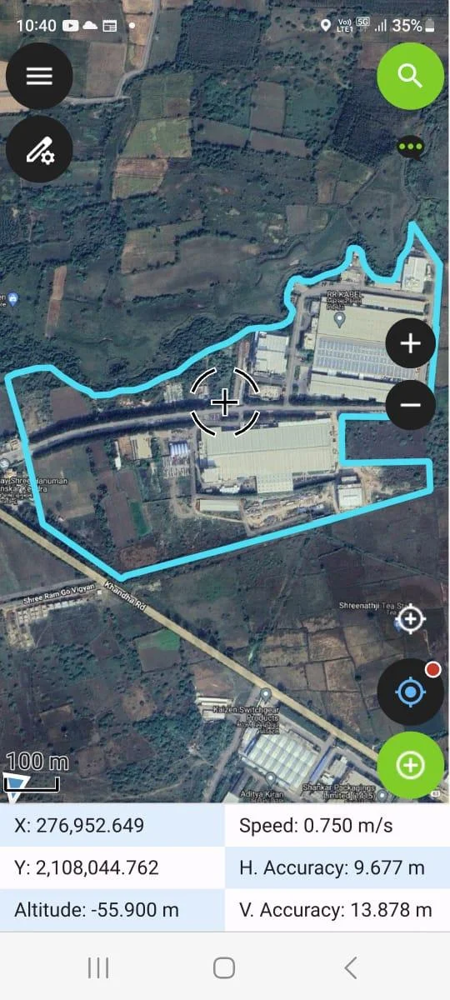
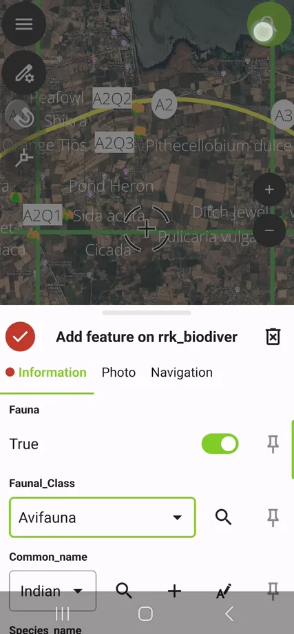
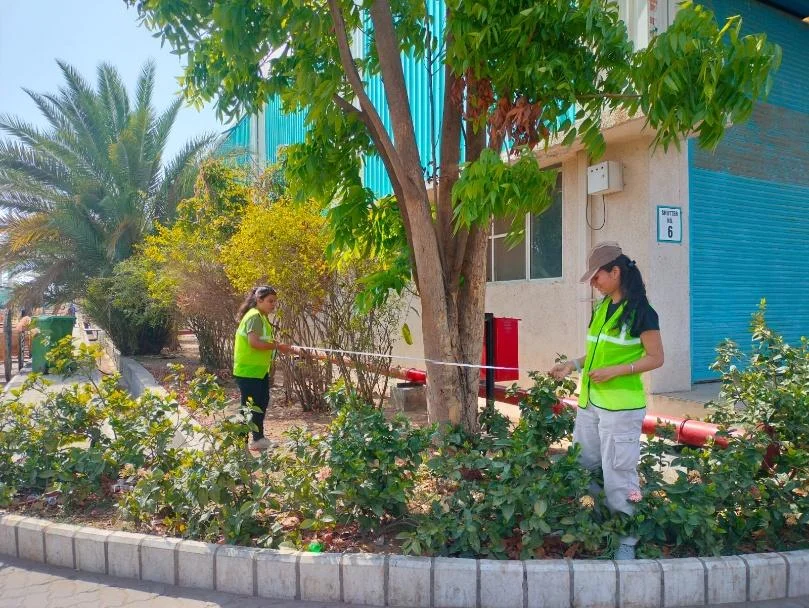
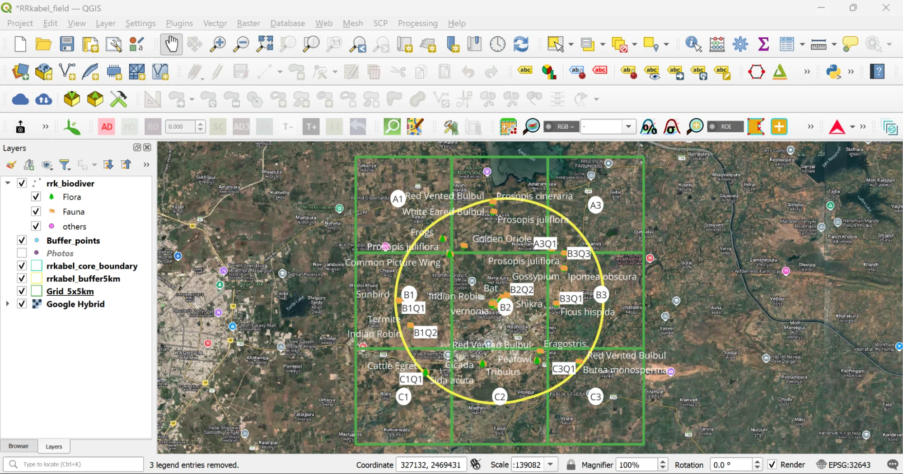
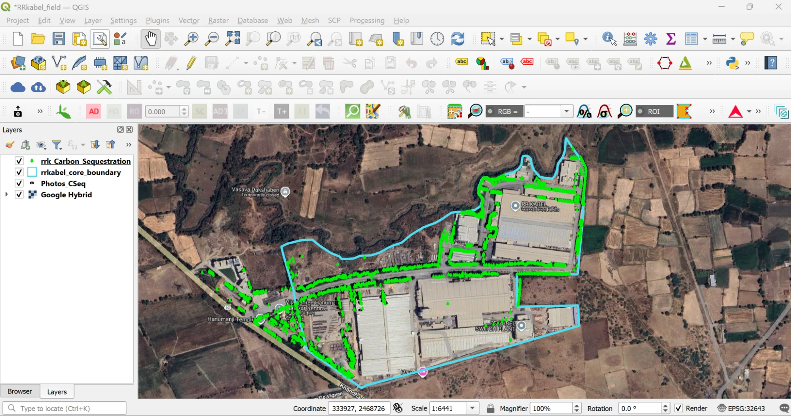



# QGIS and QField for Biodiversity Assessment and Tree Survey at RR Kabel, Gujarat

Biodiversity assessments are essential to understanding the ecological characteristics of a site and the variety of flora and fauna present. As part of this process, a tree inventory is often carried out to document the different tree species, their condition, and their distribution across the site. This creates a baseline understanding that supports better planning and management of biodiversity and green spaces.

This case study presents how **QGIS and QField** were used by [Sustaina Greens LLP](https://sustainagreens.com/) to conduct a biodiversity assessment and tree survey at the RR Kabel facility in Gujarat, India.

The objectives of the project were:

- To conduct land use and land cover mapping using GIS and remote sensing to understand the ecological profile of the site.
- To map species richness across the site using GIS and remote sensing techniques.
- To collect detailed tree-level data using the QField mobile application, along with data for flora and fauna for the biodiversity assessment.
- To capture geotagged information on individual trees in real time, including species name, girth, height, health condition, and location accuracy.

This approach ensured systematic data collection, reduced manual errors, and allowed seamless integration of field observations directly into the GIS database for further spatial analysis and reporting.

## Use of QGIS and QField

### Digital Form Design for Biodiversity and Tree Survey

The GIS and Remote Sensing team, led by Pratiksha Chalke, designed and configured a structured digital QField form for the biodiversity survey team. The form was developed within **QGIS** to ensure systematic and standardised data collection. It included key parameters such as species name, common name, fauna type, flora type, land use category, and quadrat or line transect code.

This ensured that all observations were geotagged, categorised correctly, and directly integrated into the spatial database, enabling smooth analysis and accurate biodiversity mapping.

### Tree Inventory Data Collection Workflow

For the tree inventory team, a dedicated digital form was designed to capture detailed tree-level information in a structured manner. Each entry was geotagged and recorded in real time using QField, ensuring accurate spatial positioning and seamless integration into the central GIS database.

Key parameters included in the digital survey form:

| Sr No | Parameter | Description |
|-------|-----------|-------------|
| 1 | Species Name | Scientific name of the observed flora or fauna species |
| 2 | Common Name | Local or commonly used name of the species |
| 3 | Girth | Circumference of the tree trunk measured at breast height |
| 4 | Height | Approximate height of the tree |
| 5 | Canopy Diameter | Spread of the tree canopy measured across the crown |
| 6 | Flora Type | Category of vegetation (e.g., tree, shrub, herb, climber) |
| 7 | Fauna Type | Category of fauna (e.g., bird, reptile, mammal, insect) |
| 8 | Land Use | Land use classification of the observation location |
| 9 | Quadrat / Line Transect Code | Code identifying the sampling location |
| 10 | Location Information | GPS-based coordinates captured automatically for each observation |

 

  
     
    <em>Figure 1. QField application snapshot</em>
  
  
     
    <em>Figure 2. Biodiversity data collection via QField</em>
  

 

  

<em>Figure 3. Tree parameter measurements being conducted by field officers at RR Kabel.</em>

### Field-Data Monitoring and Backend Support

The GIS team provided continuous backend support for the real-time collection and verification of both tree inventory and biodiversity data using **QGIS** via the **QField Cloud plugin**. As field teams submitted geotagged entries through QField, the GIS team monitored incoming data, checked attribute accuracy, validated spatial positioning, and ensured consistency across forms.

This real-time Quality Assurance and Quality Check (QA/QC) process reduced errors, maintained data quality, and allowed immediate corrections where required, ensuring a reliable and analysis-ready geospatial database.

  

<em>Figure 4. Visualisation in QGIS of biodiversity assessment data collected via QField.</em>

  

<em>Figure 5. Visualisation in QGIS of tree inventory data collected via QField.</em>

QGIS and QField continue to be widely used across commercial projects by Sustaina Greens for field data collection, spatial analysis, mapping, and reporting workflows. These tools complement each other — QGIS supporting backend analysis and QField enabling real-time field data capture — facilitating efficient, accurate, and scalable geospatial solutions for biodiversity assessments, environmental monitoring, and sustainability initiatives.

## Author

[Pratiksha Chalke](https://www.linkedin.com/in/pratiksha-chalke-392b9b164/) is the Lead – GIS and Remote Sensing at [Sustaina Greens LLP](https://sustainagreens.com/), a GreenTech consulting firm that delivers technically feasible and implementation-oriented sustainability solutions for public and private sector organisations. One of the core strengths of the firm lies in its integration of GIS and Remote Sensing into biodiversity assessments, tree inventories, carbon sequestration analysis, and wildlife action plans. By using advanced geospatial tools — particularly QGIS-based workflows — Sustaina Greens translates complex spatial datasets into clear, decision-ready insights that support better environmental planning and long-term sustainability management.


