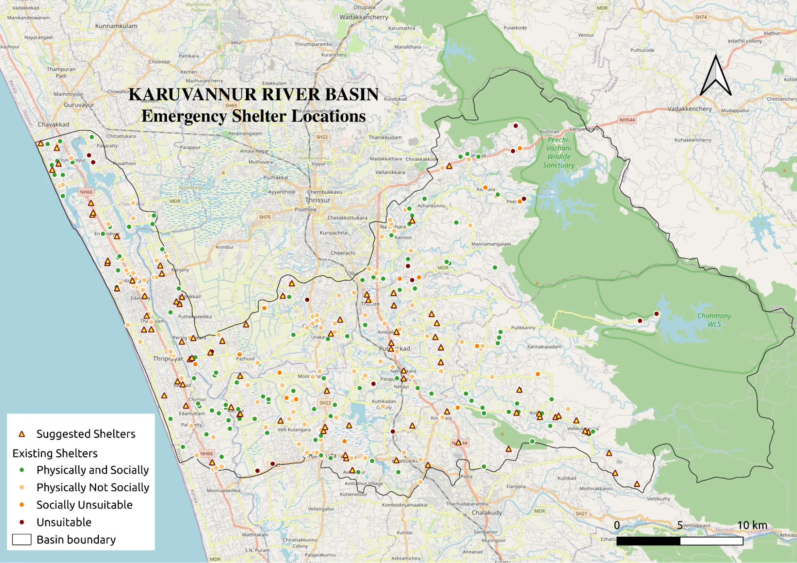



# QGIS in Action: Mapping Flood Risk and Emergency Response

Flooding is a recurring and severe hazard in India's monsoon-dominated regions, particularly in Kerala. The catastrophic floods of 2018 highlighted the need for accessible and transparent geospatial tools to support flood preparedness, emergency response, and long-term planning.

This case study shows how **QGIS and its open-source plugin ecosystem** were used to support flood risk analysis and emergency planning in the Karuvannur River Basin in Thrissur District, Kerala. Using only open-source tools, the project integrates flood risk mapping, evacuation routing, impact assessment, and shelter planning within a single GIS environment.

## Understanding Flood Risk with QGIS

To understand where and why flooding occurs, multiple environmental and land-surface factors were analysed using QGIS. Satellite imagery, elevation data, land use, soil characteristics, and hydrological indicators were processed and integrated to generate a **flood susceptibility map**.

The results highlight extensive high-risk areas in low-lying and densely populated parts of the basin, providing a clear spatial basis for preparedness and planning.

  

<em>Figure 1. Flood Susceptibility Map – Karuvannur River Basin. Flood risk zones generated in QGIS from terrain and land-surface indicators.</em>

## Planning Evacuation Routes

Safe evacuation is critical during flood events. Using the **OpenRouteService (ORS) plugin** in QGIS, evacuation routes were generated from assembly points to emergency shelters.

Both shortest-distance and shortest-time routes were analysed, incorporating slope and walking speed to reflect realistic evacuation conditions. This approach helps identify efficient and practical evacuation paths under emergency constraints.

  

<em>Figure 2. Evacuation Route Analysis Using QGIS. Shortest-distance and shortest-time evacuation routes generated using OpenRouteService.</em>

## Identifying Reachable Areas During Emergencies

To assess access to shelters during emergencies, a **service area analysis** was carried out using a 30-minute walking threshold. This mapped areas that could realistically be reached during a flood event.

The analysis highlights settlements with limited access to shelters and supports decisions on where additional emergency facilities may be required.

  

<em>Figure 3. Service Area Analysis (30-Minute Walk). Areas reachable within a 30-minute walk during a flood.</em>

## Assessing Flood Impacts with InaSAFE

Potential impacts on population and infrastructure were assessed using the **InaSAFE plugin** in QGIS. Flood hazard data were combined with exposure layers to generate maps, summaries, and reports showing affected people and buildings. These rapid outputs support prioritisation of evacuation, relief distribution, and emergency response.

  

  

<em>Figure 4. Flood Impact Assessment Using InaSAFE. Estimated impacts on population and buildings.</em>

  

<em>Figure 5. Flood Impact Summary and Humanitarian Needs Assessment. Automatically generated infographic from InaSAFE summarising the estimated affected population and the minimum humanitarian needs of displaced people. This output supports rapid decision-making during emergencies by clearly communicating critical information to planners and response teams.</em>

  

<em>Figure 6. Detailed Flood Impact Report Generated by InaSAFE. Comprehensive impact report produced by InaSAFE, providing detailed statistics on affected population and infrastructure. Such reports support evidence-based planning, documentation, and coordination among disaster management agencies.</em>

## Planning Safer Emergency Shelters

QGIS was also used to evaluate the suitability of existing and potential flood shelters. Physical factors such as flood zones, terrain, and land use were combined with social factors like population density, road access, and proximity to healthcare facilities.

This analysis helped identify safe, accessible, and well-connected shelter locations, supporting more resilient disaster preparedness planning.

  

<em>Figure 7. Flood Shelter Suitability Map. Combined shelter suitability map created in QGIS by integrating physical and social factors, helping identify safe and accessible emergency shelter locations.</em>

## Why QGIS?

QGIS was selected as the primary platform due to its **open-source nature, zero licensing cost, and strong plugin ecosystem**. These characteristics make it particularly suitable for disaster risk management in resource-constrained contexts such as local governments, academic institutions, and community organisations in India.

The ability to integrate raster analysis, network routing, and impact assessment within a single, transparent GIS environment enabled a complete flood management workflow without reliance on proprietary software.

## Conclusion

This case study demonstrates how QGIS can serve as a practical and accessible platform for flood risk management in India. By combining flood susceptibility mapping, evacuation planning, impact assessment, and shelter suitability analysis, QGIS supports informed, map-based decision-making across all stages of disaster management.

## Author

Kavya S Kutty is a Technical Assistant at International Centre for Free and Open Source Solutions and an active user of QGIS and other open-source geospatial tools. She works on community-oriented geospatial projects related to environment, public health, and infrastructure mapping, and is interested in promoting open-source GIS through knowledge sharing, capacity building, and collaborative geospatial development.

---

**Note**

*This case study was developed using entirely open-source geospatial tools and is intended to support learning, replication, and adaptation by the wider QGIS and disaster management communities.*

*Some datasets were derived from publicly available sources, while others were adapted or simulated for demonstration purposes. The results illustrate QGIS-based workflows and should not be used directly for operational disaster response without validation using authoritative local data.*


