

# Mapping the Unmapped: Participatory Resource and Ward Mapping of Vattavada Panchayat in Western Ghats using QGIS and QField

*Using open-source geospatial tools and community knowledge to create the first accurate digital ward map and interactive resource map for a remote panchayat in Kerala's Western Ghats.*

## About Vattavada Gramapanchayat

Vattavada is a rural panchayat in the Idukki district of Kerala, situated deep within the Western Ghats (Fig. 1). The panchayat is characterized by rugged, undulating mountain terrain having elevations ranging from 791m to 2,433m, dense forests, and a network of streams and ridges (Fig. 3). It comprises 13 wards, two of which are tribal villages inhabited by the Muthuvans community and are located within forest areas. Large portions of the panchayat fall under protected forest with restricted access, and most areas lack mobile network coverage.

Despite its ecological significance and complex landscape, the panchayat lacked digital spatial data for governance or planning. For years, it relied on an inaccurate hand-drawn ward boundary sketch (Fig. 2) — a rough diagram that did not reflect actual boundaries on the ground. This absence of reliable geospatial information meant that decisions on disaster management, resource allocation, and infrastructure development were being made without any spatial intelligence.

This case study documents how we used open-source toolkits — especially **QGIS**, **QField**, and participatory methods — to change that.

  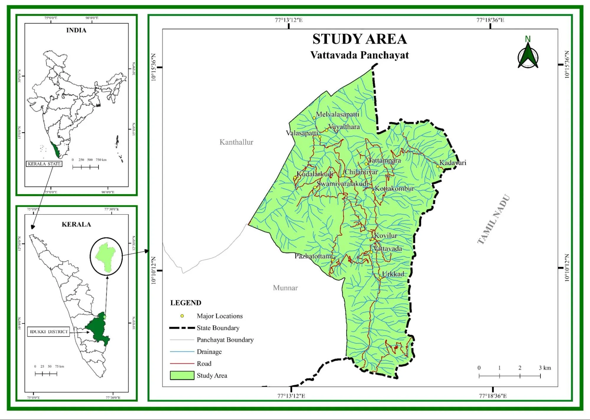

<em>Fig. 1: Location Map of Vattavada Gramapanchayat, prepared in QGIS.</em>

  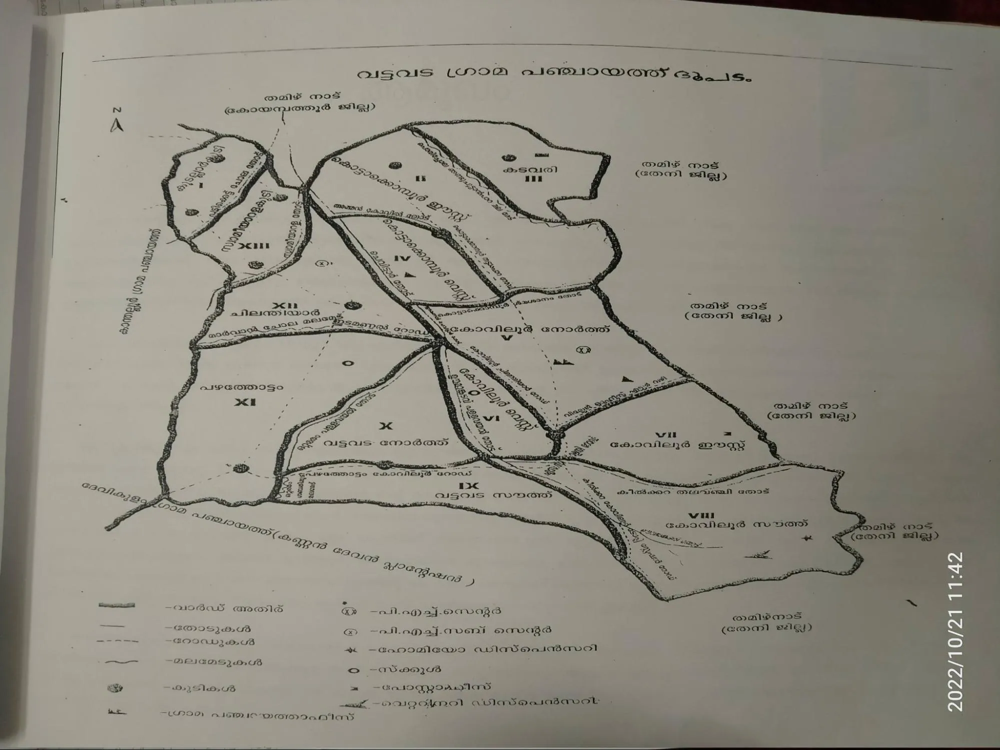

<em>Fig. 2: Old hand-drawn sketch of ward boundaries used by authorities.</em>

  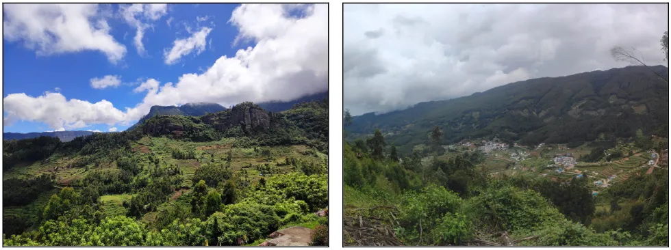

<em>Fig. 3: Undulated topography of Vattavada.</em>

## The Open-Source Toolkit

The entire workflow — from field data collection to interactive web map delivery — was built on a fully open-source geospatial stack.

**Software & Plugins:**

- **QGIS Desktop:** Digitization, spatial analysis, map composition, and base map export.
- **QField:** Mobile field data collection with offline capability, essential in areas with no network coverage.
- **Semi-Automatic Classification Plugin (SCP):** Supervised Land Use Land Cover classification of Sentinel 2A imagery.
- **QGIS2Web Plugin:** Interactive web map generation using the Leaflet framework.

## How We Did It

### Ward Boundary Demarcation

The existing hand-drawn ward sketch was inaccurate and did not reflect the actual boundaries on the ground. Unlike most panchayats, Vattavada's ward boundaries follow natural features such as streams, channels, and ridges — which are difficult to delineate from satellite imagery alone. To overcome this, we used a multi-layer approach in QGIS: Hillshade derived from DEM to identify ridges, Survey of India Toposheets for stream networks, and satellite imagery for overall context. We then consulted the former panchayat president, who had deep knowledge of the ward boundaries. By combining GIS layers with his ground knowledge, we finalized the first-ever accurate, scaled, digital ward boundary map of Vattavada (Fig. 4).

  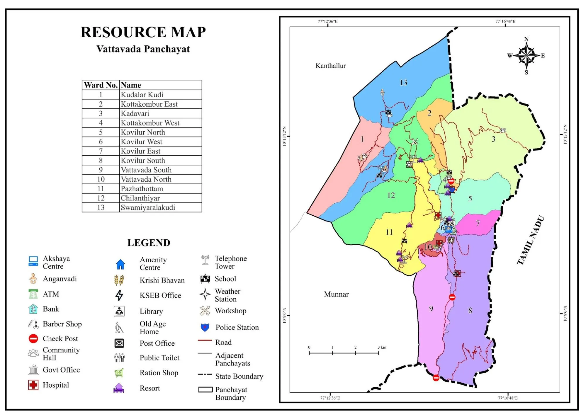

<em>Fig. 4: Prepared ward map along with collected resources of Vattavada Panchayat.</em>

  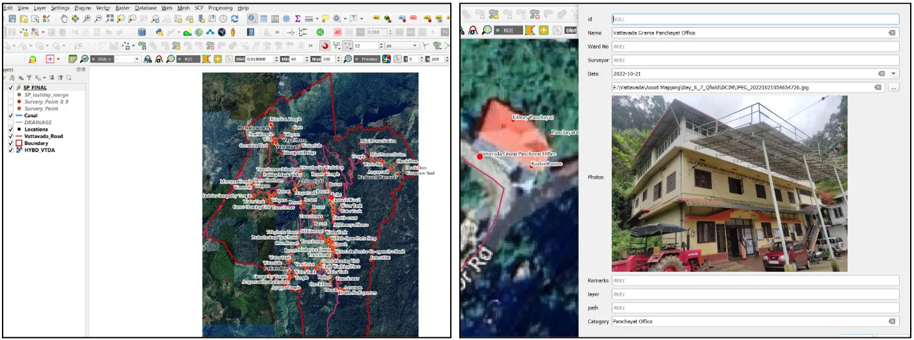

<em>Fig. 5: QGIS interface with collected assets using QField (on left) and editing attributes (on right).</em>

  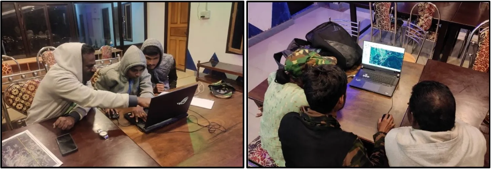

<em>Fig. 6: Digitizing ward boundaries in QGIS with the help of a local expert.</em>

### Participatory Resource Mapping with QField

We used Participatory Rural Appraisal tools like transect walks, semi-structured interviews, and field observation to identify resources across all 13 wards. The people were comfortable with the digital interface and could locate nearby resources when we showed them their position on the maps, and we verified those resources in person. Over 310 resources were mapped across natural, infrastructural, and socio-economic categories.

### Land Use Land Cover (LULC) Mapping

Sentinel 2A imagery was classified using the Support Vector Machine algorithm in QGIS using the SCP Plugin. The classification was corrected through extensive ground truthing during field surveys (Fig. 7).

  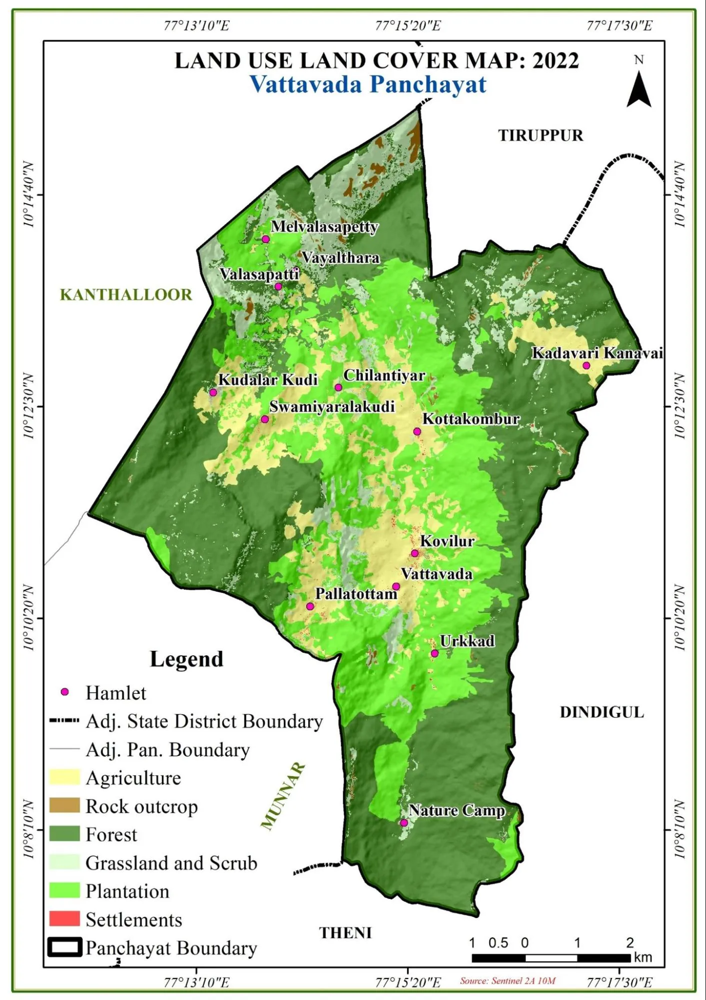

<em>Fig. 7: Land Use Land Cover map of Vattavada Panchayat.</em>

## Challenges We Faced

The project presented several unique challenges. The study area spans an elevation range of 791m to 2,433m, requiring us to physically walk through all 13 wards to collect ground truth and map resources. Two of the wards are Muthuvans community villages located within forests; the residents were reluctant to communicate with outsiders, and the forest department imposed access restrictions even for research purposes.

Most of the panchayat had no mobile network coverage, making real-time data sync impossible. **QField's offline mode**, paired with high-resolution base maps exported from QGIS, became our lifeline for field data collection. Since much of the terrain is rugged and falls under protected forest, many resource locations were not directly accessible. However, resources visible from nearby vantage points were accurately captured using QField's GPS and digitization capabilities — something a handheld GPS alone could not achieve.

On the technical side, with over 132 resources concentrated in small areas, traditional static maps could not effectively present the data, which led us to develop an interactive web map. In LULC mapping, Eucalyptus Grandis plantations were spectrally almost identical to natural forest, demanding extensive field verification to correct the classification.

  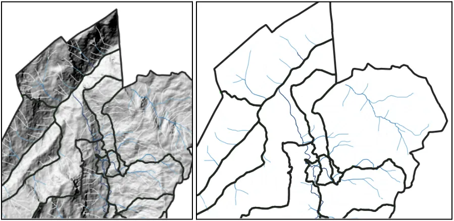

<em>Fig. 8: Hillshade and streams using DEM and Toposheet helped in demarcating ward boundaries sharing ridges and streams.</em>

  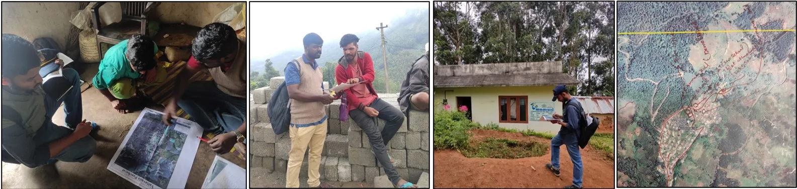

<em>Fig. 9: Residents helping in locating assets.</em>

## What We Delivered & the Impact

- The new accurate and scaled ward boundary map along with shapefiles was submitted to the panchayat, replacing the decades-old hand-drawn sketch and enabling data-driven decision-making for disaster management, resource allocation, and infrastructure planning (Fig. 10).
- Resource maps were delivered in hard copy and as an interactive web map built using the QGIS2Web Plugin with the Leaflet framework, featuring searching, layer toggling, measurement tools, and attribute exploration — effectively presenting 132+ densely clustered resources that a static map could not handle (Fig. 11).
- A Land Use and Land Cover map showing land utilization patterns across the panchayat was delivered.
- A panchayat employee in the technical section was trained on the interactive web map and its functionalities, ensuring the tools remain usable beyond the project (Fig. 10).

  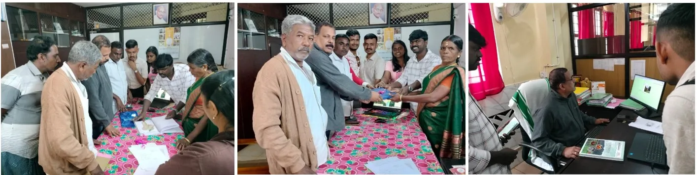

<em>Fig. 10: Submitting our work and giving training to the Panchayat officials.</em>

**Explore the interactive resource map:** [https://sreevisal.github.io/vtd-asset/index.html](https://sreevisal.github.io/vtd-asset/index.html)

  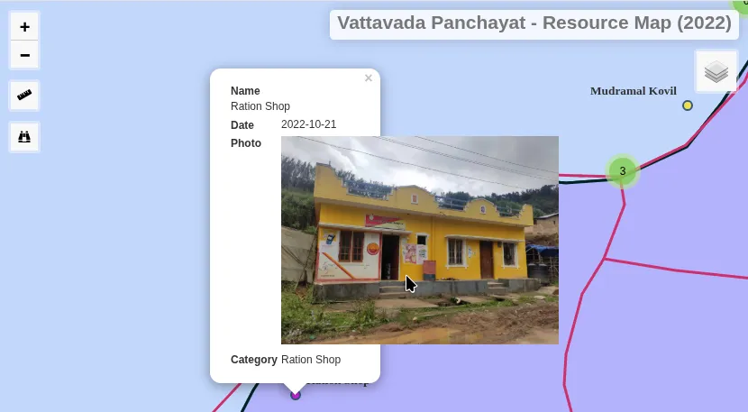

<em>Fig. 11: Interactive resource map. On clicking an asset label in the web map, the attributes of the asset along with a photograph are displayed, allowing users to visually identify and verify each resource directly from the map.</em>

## Lessons Learned

**Ground truthing is non-negotiable:** The satellite classification needs extensive field correction, especially for spectrally similar classes like Eucalyptus Grandis and natural forest.

**People understand digital maps:** Residents were comfortable with QGIS layers and could locate resources when shown their position on the maps. It is time to change the mindset that rural communities cannot understand digital maps and that we must rely only on traditional Participatory Rural Appraisal tools like drawing on the floor and locating things using available materials.

**QGIS aided by an expert and a person with strong local knowledge can create wonders:** The most accurate results came from combining GIS layers with the knowledge of people like the former panchayat president. Neither technology nor local knowledge alone was sufficient.

**QField's offline capability is a game-changer for remote, no-network areas:** Paired with base maps exported from QGIS, it enables seamless field data collection where conventional methods would have failed.

**Seamless integration of QGIS and QField made the project cost-effective:** The entire workflow from data collection to final map delivery was achieved using open-source tools with zero software cost, making it accessible and replicable for any community-level mapping initiative.

## Authors

1. **Sreevisal G,** Junior Research Fellow, Dept. of Civil Engineering, IIT Hyderabad.
2. **Arya R,** Junior Research Fellow, Dept. of Civil Engineering, IIT Hyderabad.
3. **Abhilash Sreekumar,** AI Product Engineer Intern, Urban Kisaan Pvt. Ltd., Hyderabad.
4. **Dr. Suresh S,** Assistant Professor on Contract, Department of Geography, SSUS, Ernakulam.


