

# Population Assessment of Snow Leopards and Species Distribution Modelling of Other Mammals in Himachal Pradesh using R and QGIS

## Introduction

The High Himalayan landscape is an example of highly varying topography and climate with complex environmental interactions. Connectivity in this landscape is more complex than in the plains. Ecological similarity is often stronger between areas at the same elevation even when they are separated by several kilometers, than between locations that are closer together but differ in elevation. The snow leopard is one of the main predator species occupying this landscape which spreads across the upper elevated regions of Jammu and Kashmir, Ladakh, Himachal Pradesh, Uttarakhand, Sikkim, and Arunachal Pradesh in India. Retaliatory killing due to livestock hunting, climate change, large-scale developmental projects, poaching, and unregulated tourism are some of the threats faced by the snow leopard.

  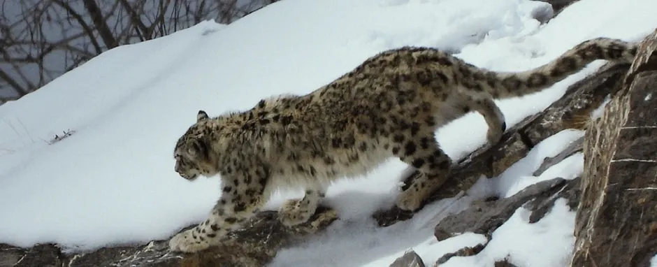

<em>Photo credit: Kesang Chunit.</em>

Given this context, the study focused on understanding the status of snow leopards and their prey in the state of Himachal Pradesh under the Snow Leopard Population Assessment of India (SPAI), India's contribution to the Population Assessment of the World's Snow Leopards (PAWS), a joint initiative of the 12 snow leopard range countries. For the most part, the planning of such a large-scale study was done with the help of maps using QGIS and the analysis was done using both R and QGIS.

## Sampling Design

The data collection was done by placing camera traps at strategic locations to obtain photographic and spatial records of snow leopard individuals. Sampling decisions were guided by maps created using QGIS. Defining the sampling universe was critical, as snow leopards occur at low densities and range across large, fragmented landscapes. Accordingly, the sampling area was delineated using the elevation bounds based on the literature from 3200 to 5200 m Above Sea Level (ASL), establishing a snow leopard range for the entire state.

  

    

      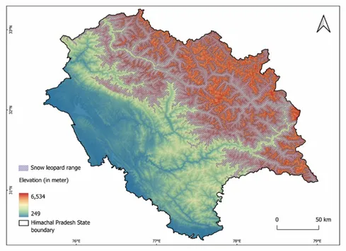
    

    
<em>Figure 1. Snow leopard range in Himachal Pradesh derived from elevation bounds.</em>

  

  

    

      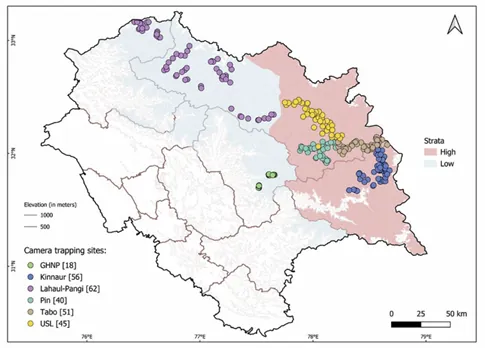
    

    
<em>Figure 2. Camera trapping sites across high and low occupancy strata.</em>

  

Along with elevation range, additional factors such as tree cover were combined with prior occupancy knowledge from a previous assessment to delineate two spatial strata representing relatively high and low occupancy regions. This stratification helped minimise spatial bias arising from preferential sampling of well-known areas. The stratified landscape was then subdivided into 4 x 4 km grid cells, converting a continuous and heterogeneous landscape into discrete sampling units. This approach ensured an even distribution of camera traps across the snow leopard range, with one camera placed per grid, approximately near the grid centre where terrain permitted. Field-based information, including snow leopard signs and markings, was subsequently used to guide micro-site selection within each grid.

  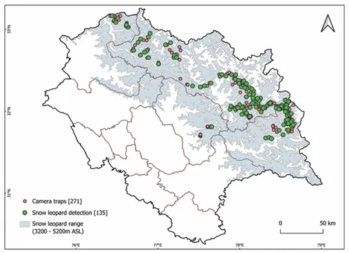

<em>Figure 3. Snow leopard detections from camera traps.</em>

## Spatial Planning and Field Operations

Maps were critical for planning the sequencing of fieldwork across seasons. The survey was conducted over four rounds spanning spring, summer, and autumn-early winter of the year 2024, during which 271 camera traps were deployed across the snow leopard habitat for 60 days of sampling.

  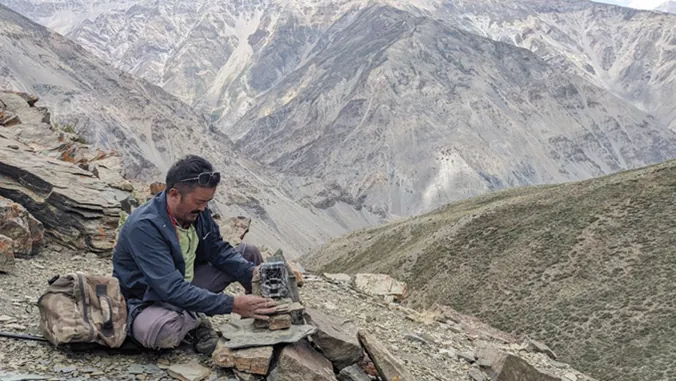

<em>Photo credit: Nature Conservation Foundation.</em>

Seasonal accessibility varied across regions due to snowfall, flood risk, and road connectivity. Survey sites were therefore prioritised based on terrain behaviour in relation to seasonality and prevailing weather conditions, which played a key role in determining the final sequence of effort. Maps also facilitated coordination among multiple field teams, enabling progress tracking and systematic recording of sampled locations using GPS.

## Species Distribution Modelling

While the primary objective of the camera trapping exercise was to estimate snow leopard populations, the spatial structure of the study enabled the study of other mammals captured in the camera traps. The camera traps having spanned a wide range of terrain and habitat types, the resulting detections were well suited for species distribution modelling. This allowed assessment of the potential distributions of selected mammals within the snow leopard range. The data preparation, which involved obtaining slope, aspect, ruggedness, NDVI, bioclimatic variables, and spatial thinning of occurrence points, was done with the help of QGIS along with the visualisation. The species distribution modelling was done with the help of R using the SSDM package. Selected outputs from the species distribution modelling are shown below (Figure 4), illustrating the predicted distributions of individual species across the snow leopard landscape.

<table width="100%">
  <tr>
    <td width="100%" align="center" colspan="2">
      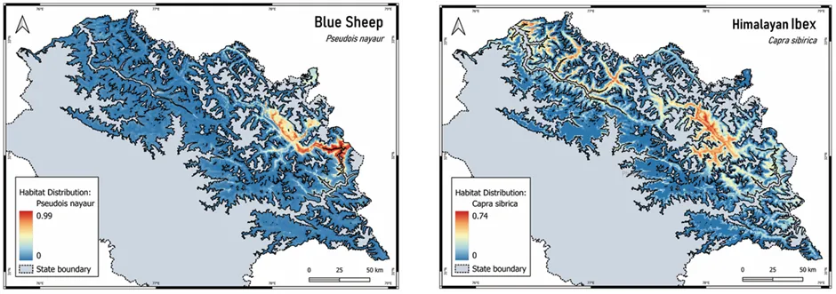
    </td>
  </tr>
  <tr>
    <td width="50%" align="center">
      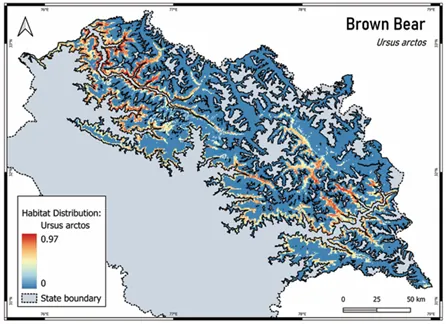
    </td>
    <td width="50%" align="center">
      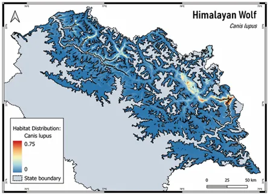
    </td>
  </tr>
  <tr>
    <td width="50%" align="center">
      
    </td>
    <td width="50%" align="center">
      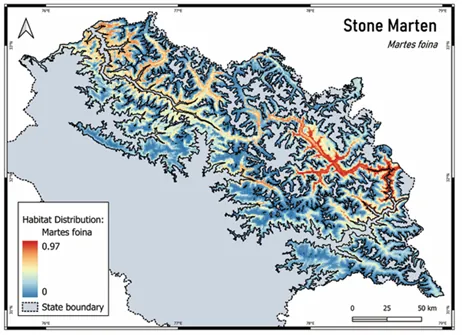
    </td>
  </tr>
  <tr>
    <td width="50%" align="center">
      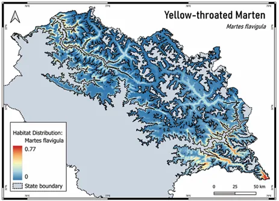
    </td>
    <td width="50%" align="center">
      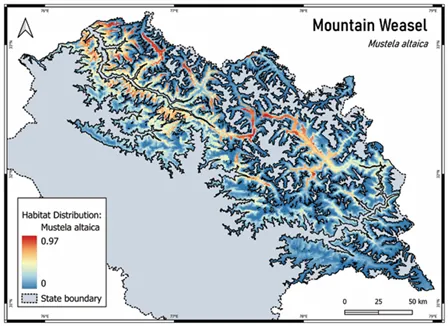
    </td>
  </tr>
</table>

<em>Figure 4. Species distribution models showing major mammalian species (Blue Sheep, Himalayan Ibex, Brown Bear, Himalayan Wolf, Red Fox, Stone Marten, Yellow-throated Marten, and Mountain Weasel) across the snow leopard landscape in Himachal Pradesh.</em>

## Synthesis

The second round of population survey in Himachal Pradesh estimated 83 snow leopard individuals (95% CI: 67-103) in the year 2024. The analyses for this were done with the help of the SECR package in R. This statewide camera trapping exercise produced a robust estimate of snow leopard populations in Himachal Pradesh, with detections recorded across all sampled regions and ecological strata. Achieving this coverage within a single field year highlights the feasibility of large-scale monitoring for low-density, wide-ranging species when survey design and effort are well structured.

By guiding sampling design, effort allocation, field sequencing, data curation, and visualization, QGIS contributed to the robustness of the survey design. Overall, this case study highlights the role of QGIS as a planning and collaborative tool rather than merely a mapping tool.

*Note: The project was carried out as a collaborative effort by the **Wildlife Wing of the Himachal Pradesh Forest Department** and the **Nature Conservation Foundation**, Mysuru.*

**Further Reading:** [Anon. 2025. Status of snow leopard in Himachal Pradesh, 2025. Wildlife Wing - Himachal Pradesh Forest Department, Government of Himachal Pradesh, Shimla.](https://images.assettype.com/ncfindia/2025-10-13/wj7dw0hs/PAWS_Report_Final_Updated_040825_spreads__1_.pdf)

## Author

**Rajat Rao** is an independent researcher working at the intersection of ecology and geospatial science. His interests lie in using GIS, remote sensing, and spatial modelling to address conservation questions, particularly in complex mountain landscapes. He has a background in electronics engineering, a Master's degree in Wildlife Sciences, and is fascinated by GIS.


