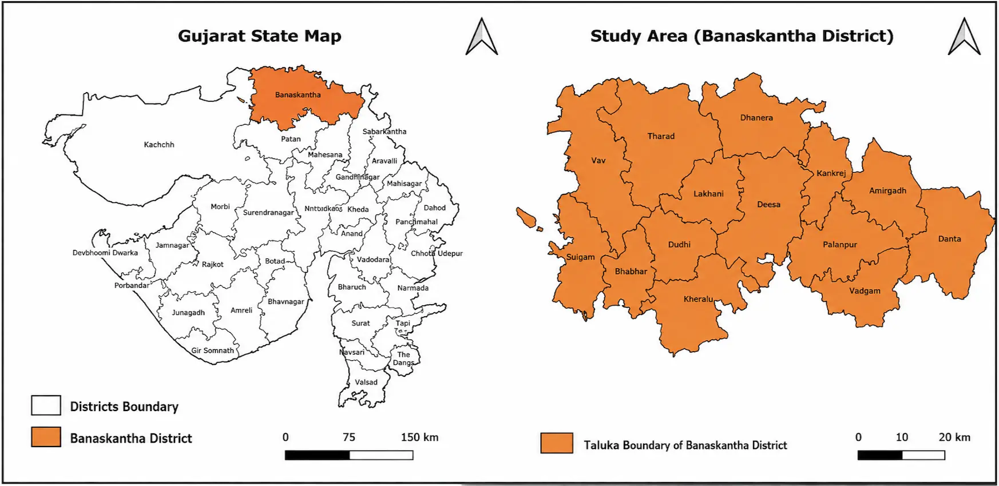
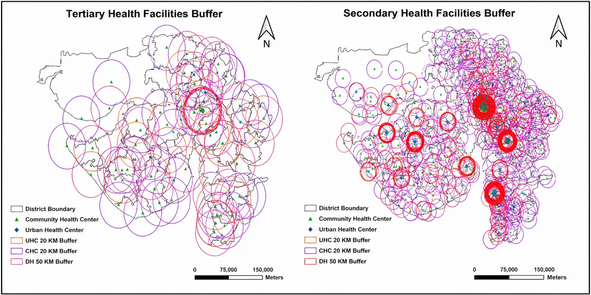
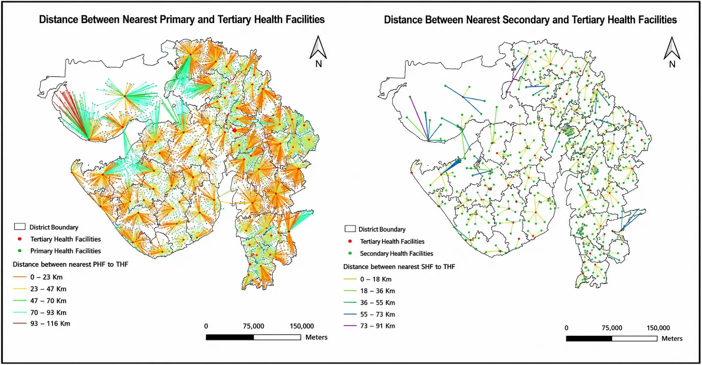
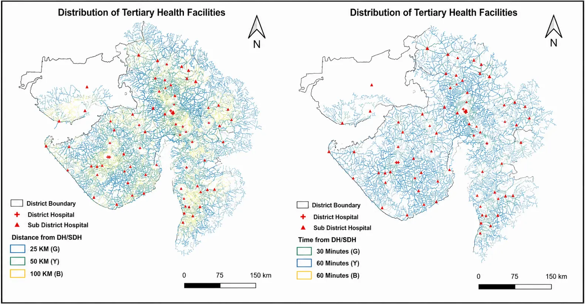
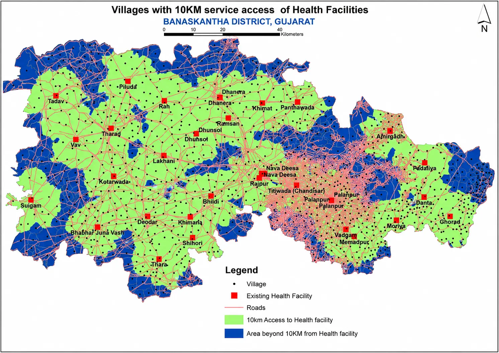



# Spatial Accessibility of Public Healthcare Facilities Using QGIS

## Executive Summary

Healthcare access in rural India remains deeply unequal, yet planning decisions rarely incorporate rigorous spatial evidence. Open-source Geographic Information System (GIS) tools have emerged as powerful and scalable approaches for assessing healthcare accessibility and supporting evidence-based planning across districts and regions. This study demonstrates how QGIS, a freely available open-source GIS platform, can generate policy-grade accessibility analysis for Banaskantha District, Gujarat. Using QGIS tools including buffer analysis, QNEAT3 network routing, service area delineation, and the 2SFCA method, the study identifies critical facility gaps across 14 talukas. Findings confirm that peripheral talukas Tharad, Vav, Danta, and Amirgadh remain severely underserved, with actual travel times frequently exceeding 60 minutes. QGIS proves that open-source tools can meaningfully inform equitable public healthcare planning.

## Introduction

Access to healthcare services is a fundamental component of public health systems and plays a crucial role in determining health outcomes, particularly in developing countries such as India. Despite significant policy efforts aimed at expanding healthcare infrastructure, spatial disparities in the distribution of public healthcare facilities remain a persistent challenge in many regions of India (Kumar et al., 2025; Tu et al., 2025). These disparities are especially pronounced between urban centers and rural or peripheral areas, where residents often encounter considerable geographical barriers to accessing essential healthcare services. Such inequalities affect maternal and child health outcomes, disease treatment, emergency response times, and overall well-being (Zere et al., 2012). In this context, geospatial technologies have emerged as valuable tools for analyzing healthcare accessibility and supporting evidence-based planning.

Geographic Information Systems (GIS) allow researchers and policymakers to investigate spatial patterns of healthcare infrastructure, population distribution, and transportation networks in an integrated analytical environment (Shaw, 2012; Firouraghi et al., 2022). Among available GIS platforms, QGIS has gained prominence due to its open-source architecture, flexibility, and extensive analytical capabilities. Unlike conventional mapping approaches, QGIS enables integrated analysis of facility distribution, road network topology, population demand, and administrative geography within a unified computational environment.

This case study presents a systematic, multi-method spatial accessibility analysis conducted for Banaskantha District, located in the northern region of Gujarat State, India. Banaskantha is a predominantly tribal rural district with a total geographical area of approximately 10,743 km² and a population of approximately 3.12 million (Census of India, 2011). The district comprises 14 talukas and over 1,500 revenue villages, with significant intra-district variation in road network density and population distribution making it an analytically suitable context for demonstrating the added value of GIS-based accessibility assessment beyond conventional distance metrics.

The objective of the study was not merely to visualize healthcare infrastructure; rather, it sought to develop a comprehensive analytical framework for identifying geographically underserved areas and quantifying disparities in healthcare accessibility. By integrating spatial data on healthcare facilities, road networks, administrative boundaries, and population distribution, the study demonstrates how QGIS can be used as a decision-support tool in public health planning. The analysis combines several geospatial techniques including facility mapping, buffer analysis, network-based analysis, service area analysis, and the Two-Step Floating Catchment Area (2SFCA) method. The analysis also responds to World Health Organisation (WHO) guidance on measuring effective health service coverage (WHO, 2020), which emphasises that physical proximity to a facility does not alone constitute access; travel time, transportation infrastructure, and supply-to-demand ratios must be jointly considered. By applying this framework using QGIS, the study demonstrates that open-source geospatial tools are capable of producing policy-grade spatial evidence at district and sub-district levels.

## Study Area

The study was conducted in Banaskantha District, Gujarat (23°–24°N, 71°–72°E). The district is characterised by a semi-arid agrarian landscape, with the Banas River and its tributaries shaping settlement patterns. Healthcare infrastructure is anchored by one District Hospital at Palanpur, supported by Community Health Centres (CHCs) at taluka levels and a network of Primary Health Centers (PHCs) and Sub-Centres serving village clusters. Road connectivity varies substantially across the district, with national highway NH-27 providing relatively rapid access in the northern corridor, while interior rural roads in the eastern talukas remain poorly developed. This heterogeneity in both infrastructure and population distribution creates measurable inequalities in effective healthcare access that are not discernible through administrative records alone.

  

<em>Fig. 1. Study area map of Banaskantha District, Gujarat.</em>

Figure 1 explains the geographical location and administrative delineation of Banaskantha District within the state of Gujarat, India. The left panel positions Banaskantha District in the northernmost part of Gujarat, bordered by Rajasthan to the north, Sabarkantha and Patan districts to the east and south, and Kachchh to the west, highlighting its strategic location along the state's frontier zone. The right panel provides a detailed view of the district's internal administrative structure, comprising fourteen talukas namely Dhanera, Tharad, Vav, Lakhani, Kankrej, Amirgadh, Danta, Deesa, Dudhi, Palanpur, Vadgam, Kherali, Bhabhar, and Sulgam each demarcated by distinct taluka boundaries. Palanpur, the district headquarters, serves as the central administrative node of the region. Banaskantha District, covering an area of approximately 12,703 sq. km., is predominantly semi-arid in character and forms a critical part of northern Gujarat's agro-ecological and socio-economic landscape. The spatial extent and taluka-level disaggregation depicted in this figure provide the foundational geographic framework for the analysis conducted in the present study.

## Mapping the Spatial Distribution of Healthcare Facilities Using QGIS

The analytical process began with the compilation and preparation of spatial datasets related to healthcare infrastructure and population distribution. Data on public healthcare facilities were collected from government health records and included the geographic locations of CHCs, Urban Health Centres (UHCs), Sub-district hospitals, and District Hospitals. These facilities represent different levels of the public healthcare system, each serving specific functions within the broader healthcare delivery structure. Population data were obtained at the village and ward levels to ensure that spatial accessibility could be evaluated in relation to population demand.

| Dataset | Source | Purpose |
|---|---|---|
| Public Healthcare Facilities (CHCs, UHCs, Sub-district and District Hospitals) | Government Health Records, National Health Mission (NHM) MIS Portal | Mapping facility locations and levels of care |
| Village Population Data | Census of India 2011 | Estimating population demand at sub-district level |
| Road Network | OpenStreetMap (OSM) via QGIS QuickOSM plugin | Network routing, travel-time computation |
| Administrative Boundaries (District, Taluka) | Survey of India | Spatial reference frame and overlay analysis |

<em>Table 1: Spatial Datasets Used in the Analysis</em>

All datasets were imported into QGIS and carefully examined to ensure spatial consistency. Because spatial datasets often originate from different sources, they frequently use different coordinate reference systems. To ensure accurate spatial analysis, all layers were re-projected into a common coordinate system within QGIS. Additional data cleaning steps were also undertaken to remove duplicate entries, verify geographic coordinates, and ensure that facility locations accurately corresponded with administrative boundaries.

Once the datasets were prepared, a base map was constructed in QGIS integrating administrative boundaries, healthcare facility locations, population settlements, and the regional road network. The visualization capabilities of QGIS were used to symbolize different types of healthcare facilities using distinct colors and markers. This cartographic representation provided an initial overview of the spatial distribution of healthcare infrastructure across the study area.

## Assessing Geographic Coverage Through Buffer Analysis

The next stage of the analysis involved assessing the geographic coverage of healthcare facilities using buffer analysis. Buffer zones represent areas within a specified distance from a particular spatial feature and are commonly used in spatial planning to estimate service coverage. Using QGIS, buffers were generated around CHCs and UHCs using standard planning thresholds frequently applied in public health infrastructure assessment.

Buffer zones of 20 km and 50 km were created to represent varying levels of service coverage. The buffer thresholds of 20 km and 50 km were selected based on established public health planning norms for India. The Indian Public Health Standards (IPHS), published by the Ministry of Health and Family Welfare, Government of India, prescribe service catchment norms for public health facilities (IPHS, 2022). Accordingly, a 20 km threshold was adopted to reflect the normative service catchment area of CHCs and UHCs, while a 50 km threshold was used to represent the normative service catchment area of sub-district hospitals and district hospitals. These standards are consistent with international benchmarks used in WHO guidance on healthcare accessibility (WHO, 2010; Peters et al., 2008). The QGIS buffer tool allowed these zones to be generated quickly while maintaining spatial accuracy.

  

<em>Fig. 2. Geographical Area within 20 km and 50 km Service Area Buffers of Public Health Facilities in Banaskantha District, Gujarat.</em>

To assess the geographical reach of existing public healthcare infrastructure in Banaskantha District, a buffer-based service area analysis was conducted for all mapped facilities. Buffers of 20 km were applied around CHCs and UHCs, representing their expected secondary-level service catchment, while a 50 km buffer was applied around District Hospitals to reflect their broader tertiary-level referral function. The resulting spatial coverage patterns, illustrated in Figure 2, reveal several important insights into the distribution and accessibility of healthcare services across the district.

### Coverage at the Tertiary Level

At the tertiary level, the District Hospital buffer zones depicted as large red circles extending up to 50 km broadly encompass much of the central and southern portions of Banaskantha District. This suggests that a significant share of the district's population resides within the theoretical catchment of at least one District Hospital. However, a closer spatial examination reveals that the northwestern talukas particularly Tharad and Vav and certain eastern peripheries including Danta and Amirgadh, fall partially or entirely outside the 50 km DH service radius. For communities situated in these remote frontier zones, accessing tertiary-level care would necessitate travel well beyond 50 km, a burden that is especially acute for elderly patients, pregnant women, and individuals requiring emergency medical attention. This spatial gap at the tertiary level underscores a structural inequality in the distribution of higher-order healthcare infrastructure within the district.

### Coverage at the Secondary Level

The secondary-level buffer analysis, depicted in the right panel of Figure 2, presents a more granular picture of facility coverage across the district's fourteen talukas. While CHC and UHC buffers collectively cover a considerable area, a pattern of spatial clustering is clearly evident: the majority of facilities and their associated catchment zones are concentrated in the central and eastern talukas, including Palanpur, Deesa, Disa, and Kankrej. In contrast, the peripheral talukas of Tharad, Vav, Sulgam, and Bhabhar in the west, and Danta in the northeast, exhibit markedly lower facility density, with several villages visibly falling outside the 20 km secondary-level service threshold.

This uneven spatial distribution implies that a measurable proportion of the rural population in Banaskantha's outer talukas lacks reasonable proximity to a functioning CHC or UHC. For these communities, the nearest secondary health facility may be located at a distance that is practically inaccessible particularly given the semi-arid terrain, limited road infrastructure, and low levels of private vehicle ownership that characterize much of rural Banaskantha. The consequence is a compounded disadvantage: not only are facilities physically distant, but the barriers of transport cost, travel time, and road quality further diminish effective accessibility.

### Overlapping Coverage and Redundancy

A notable observation emerging from both panels of Figure 2 is the significant degree of buffer overlap in the central portions of the district. Multiple CHC, UHC, and District Hospital catchment zones converge in areas such as Palanpur and Deesa, resulting in a concentration of theoretical coverage that far exceeds the service requirements of the local population. While such overlap may appear to indicate robust healthcare provision, it simultaneously reflects a misallocation of facility resources — wherein certain areas are served by multiple facilities in close proximity, while vast stretches of the district's periphery remain outside any meaningful service catchment. This pattern of geographic inequity in facility distribution is a critical concern from a public health planning perspective and calls for a strategic reorientation of healthcare infrastructure toward underserved zones.

## Evaluating Real-World Accessibility Through Network Analysis

To capture the actual travel conditions experienced by residents, the road network dataset was integrated into QGIS and structured as a routable network layer. The road network dataset used in this study was sourced from OpenStreetMap (OSM) and supplemented with data from the Survey of India, Government of India, accessed for the reference year 2024–25. This allowed the analysis to move beyond simple distance measurements and estimate travel distance and travel time along existing road networks. Different categories of roads were assigned estimated travel speeds based on their functional hierarchy. The network comprised motorised road transport infrastructure, including national highways, state highways, district roads, major district roads, and rural roads. Public transit or non-motorised transport modes were not incorporated, as the analysis focuses on road-based accessibility for the general population using private or shared motor vehicles. Travel time was estimated by dividing network route distance by road-category-specific assumed average travel speeds: national highways 60 km/h; state/district roads 40 km/h; rural roads 20 km/h. These speed assumptions are consistent with benchmarks used in analogous healthcare accessibility studies in rural India (Guagliardo, 2004; Noor et al., 2006) and reflect realistic travel conditions in semi-arid districts. The QGIS Network Analysis Toolbox 3 (QNEAT3) plugin was used to compute shortest-path travel times (Dijkstra, 1959). Using the routing tools available in QNEAT3, shortest-path travel times were calculated from each village settlement centroid to the nearest public healthcare facility, allowing comparison of network-based travel time against straight-line distance for all populated settlements in the district.

  

<em>Fig. 3. Shortest network-based route from each village settlement to the nearest public healthcare facility, Banaskantha District, Gujarat. Routes are derived using the road network dataset (OpenStreetMap, 2023) integrated within QGIS.</em>

The results revealed important differences between geographic proximity and actual accessibility. In several cases, settlements that appeared geographically close to a healthcare facility required substantially longer travel times due to indirect road routes or poor connectivity. In remote or hilly areas, travel times sometimes exceeded thirty minutes even when the straight-line distance was relatively short.

To further interpret the results, travel times were categorized into four accessibility levels ranging from less than fifteen minutes to more than sixty minutes. This classification allowed the creation of a travel-time accessibility map illustrating spatial variations in healthcare access across the study region.

  

<em>Fig. 4. Travel time accessibility map showing settlement-level travel times to the nearest public healthcare facility.</em>

This analysis highlighted several accessibility bottlenecks, particularly in peripheral areas with limited transportation infrastructure. These findings emphasized the importance of incorporating network-based analysis in healthcare planning rather than relying solely on Euclidean distance.

## Service Area Analysis and Realistic Healthcare Catchments

Building on the network analysis, a service area analysis was conducted to determine the geographic areas that could realistically reach a healthcare facility within an acceptable travel time threshold. A thirty-minute travel time was selected as the benchmark for acceptable access to healthcare services.

The network analysis capabilities of QGIS, specifically QNEAT3, were used to generate service area polygons that represent areas accessible within 30 and 60 minutes of travel time along the road network, applying the travel-speed parameters described above. Unlike circular buffers, these service areas reflect the actual shape of the transportation network and therefore provide a more accurate representation of real-world accessibility.

The service area analysis revealed several interesting patterns. Some settlements located within the 50 km buffer zones were actually outside the 30-minute and 60-minute service areas due to indirect road routes. Conversely, other settlements located farther away from healthcare facilities were able to reach them quickly because of direct road connections. These findings illustrate how network-based service area analysis provides a more realistic measure of accessibility rather than simple distance buffers.

## Integrating Population Demand Using the Two-Step Floating Catchment Area Method

While distance and travel time provide important indicators of accessibility, they do not account for competition for healthcare services among populations. To incorporate both supply and demand factors, the study applied the Two-Step Floating Catchment Area (2SFCA) method within the QGIS analytical environment. The 2SFCA method, originally proposed by Luo and Wang (2003), is a widely used spatial accessibility measure that integrates both the supply of healthcare services and the spatial distribution of the population that demands those services. Unlike simple proximity measures, the 2SFCA accounts for competition among populations located within a shared catchment area, thereby producing a more realistic composite accessibility index. The method has been extensively validated in public health research and is particularly appropriate for evaluating healthcare accessibility in geographically heterogeneous settings.

The first step involved defining a thirty-minute travel catchment around each secondary and tertiary healthcare facility using the network dataset. The total population within each catchment area was calculated using spatial joins between settlement population data and the catchment polygons. This allowed the calculation of a supply-to-demand ratio representing the availability of healthcare services relative to the population served by each facility. In this study, supply is operationalised as the number of public healthcare facilities within the defined catchment area of a given settlement, by facility type. Specifically, CHCs, UHCs, Sub-District Hospitals, and District Hospitals are each assigned a capacity reflecting their functional role within India's tiered public health system. This count constitutes the supply variable used in computing the supply-to-demand ratio in Step 1 of the 2SFCA method.

In the second step, the accessibility score for each settlement was calculated by summing the supply-to-demand ratios of all facilities accessible within the 30-minute and 60-minute travel thresholds. This produced a composite accessibility index reflecting the combined effects of facility capacity, population demand, and travel time.

  

<em>Fig. 5. Village-level spatial accessibility scores derived using the Two-Step Floating Catchment Area (2SFCA) method, Banaskantha District, Gujarat. Villages are colored by accessibility score (low to high: red to green).</em>

The accessibility map (Figure 5) displays villages color-coded by their composite 2SFCA accessibility score, ranging from low (blue/warm tones) to high (green/cool tones). The blue areas represent villages with the lowest accessibility scores, indicating high population pressure relative to available healthcare capacity within the 30-minute catchment.

The results demonstrated pronounced spatial inequality in healthcare accessibility. Urban areas generally exhibited higher accessibility scores due to the presence of multiple overlapping facilities and greater healthcare capacity. In contrast, peripheral regions displayed lower accessibility scores despite sometimes having a nearby healthcare facility. This occurred because those facilities were required to serve large populations with limited resources.

## Conclusion

QGIS is a free and open-source GIS platform that provides a practical and scalable solution for conducting healthcare accessibility assessments across districts and regions. Using Banaskantha District as a case study, this analysis demonstrates that QGIS is fully capable of generating the spatial evidence required for informed healthcare planning without reliance on expensive proprietary software. Every step facility mapping, buffer analysis, network routing, service area analysis, and the 2SFCA method was completed within QGIS using publicly available data. The findings are not entirely unexpected, but they are important to document systematically. Facilities in Banaskantha District are not distributed according to where people need them most. Palanpur and Deesa have reasonable coverage. Tharad, Vav, Danta, Amirgadh, Sulgam, and Bhabhar do not. Buffer maps suggested the situation was manageable, but once real road distances were measured, many villages turned out to be more than 60 minutes away from the nearest facility. That is a significant gap, particularly for pregnant women, elderly patients, or anyone facing a medical emergency. The 2SFCA results reinforced this further. Even where a facility exists within reach, it is often serving far more people than it was designed for. So the problem is not just distance it is also the mismatch between how many people need care and how much capacity is actually available. The broader point is straightforward. Knowing where facilities are located is not the same as knowing whether people can reach them. Road quality, travel time, and population pressure all shape real-world access in ways that simple maps cannot show. This study worked through those layers one by one, and the picture that emerges calls for clear action such as more facilities in underserved talukas, better rural roads, and regular spatial monitoring of where gaps are growing. District health departments do not need large budgets or specialist software to do this kind of work. QGIS makes it possible for any planning team willing to engage seriously with spatial data.

## Limitation of Study

This case study was developed using open-source geospatial tools to demonstrate replicable workflows for healthcare accessibility assessment. While the analytical framework is robust, operational implementation should rely on validated and up-to-date administrative data.

While buffer analysis offers a useful spatial overview, it relies on straight-line Euclidean distances and does not account for actual road conditions, route circuity, or transportation availability and therefore tends to overestimate real-world accessibility. To overcome this limitation, the analysis was extended to network-based travel-time modelling, incorporating the actual road network of Banaskantha District to provide a more accurate and policy-relevant assessment of healthcare accessibility.

## Acknowledgement

The author acknowledges the use of OpenAI ChatGPT to assist with language editing, grammar correction, and readability of the manuscript. The author carefully reviewed and verified all content generated with AI assistance and takes full responsibility for the accuracy, interpretation, and integrity of the final manuscript.

## Funding

No funding was received for conducting this study.

## Author

[Dr. Vijay Kumar](https://www.linkedin.com/in/dr-vijay-kumar-18b634267/) is an Assistant Professor in the Department of Economics at the TAPMI School of Business, Faculty of Management, Commerce and Arts (FoMCA), Manipal University Jaipur, Rajasthan, India. He holds a Ph.D. in Economics with a specialization in healthcare accessibility and regional inequalities. You can read more about him at his [webpage](https://www.jaipur.manipal.edu/fomca/faculty-details.php?url=963/). The author can also be reached at [vijayrewar27@gmail.com](mailto:vijayrewar27@gmail.com) or [vijay.kumar@jaipur.manipal.edu](mailto:vijay.kumar@jaipur.manipal.edu).

## References

- Census of India (2011). Primary Census Abstract. Office of the Registrar General and Census Commissioner, India.
- Dijkstra, E.W. (1959). A note on two problems in connexion with graphs. *Numerische Mathematik*, 1(1), 269–271.
- Firouraghi, N., Kiani, B., Jafari, H. T., Learnihan, V., Salinas-Perez, J. A., Raeesi, A., Furst, M., Salvador-Carulla, L., & Bagheri, N. (2022). The role of geographic information system and global positioning system in dementia care and research: a scoping review. *International Journal of Health Geographics*, 21(1), 8. https://doi.org/10.1186/s12942-022-00308-1
- Guagliardo, M.F. (2004). Spatial accessibility of primary care: concepts, methods and challenges. *International Journal of Health Geographics*, 3(1), 3.
- Kumar, V., Sahoo, P. M., Tripathi, T., & Rout, H. S. (2025). Disparities in spatial access to healthcare facilities for pregnant women: a case study of a hilly region in India. *BMC Pregnancy and Childbirth*, 26(1), 6. https://doi.org/10.1186/s12884-025-08478-z
- Luo, W., & Wang, F. (2003). Measures of spatial accessibility to healthcare in a GIS environment: synthesis and a case study in the Chicago region. *Environment and Planning B: Planning and Design*, 30(6), 865–884.
- Ministry of Health and Family Welfare, Government of India (2022). Indian Public Health Standards (IPHS) Guidelines for Primary Health Centres. New Delhi: MOHFW.
- Noor, A.M., Zurovac, D., Hay, S.I., Ochola, S.A., & Snow, R.W. (2006). Defining equity in physical access to clinical services using geographical information systems as part of malaria planning and monitoring in Kenya. *Tropical Medicine and International Health*, 9(9), 917–926.
- Peters, D.H., et al. (2008). Poverty and access to healthcare in developing countries. *Annals of the New York Academy of Sciences*, 1136(1), 161–171.
- Shaw, N.T. (2012). Geographical information systems and health: current state and future directions. *Healthcare Informatics Research*, 18(2), 88–96. https://doi.org/10.4258/hir.2012.18.2.88
- Tu, Y., Chen, B., Liao, C., Wu, S., An, J., Lin, C., Gong, P., Chen, B., Wei, H., & Xu, B. (2025). Inequality in infrastructure access and its association with health disparities. *Nature Human Behaviour*, 9(8), 1669–1682. https://doi.org/10.1038/s41562-025-02208-3
- World Health Organization (2010). WHO guidance on measuring healthcare access. Geneva: WHO.
- World Health Organization (2020). Monitoring the building blocks of health systems: a handbook of indicators and their measurement strategies. Geneva: WHO Press.
- Zere, E., Kirigia, J.M., Duale, S., & Akazili, J. (2012). Inequities in maternal and child health outcomes and interventions in Ghana. *BMC Public Health*, 12, 252. https://doi.org/10.1186/1471-2458-12-252


