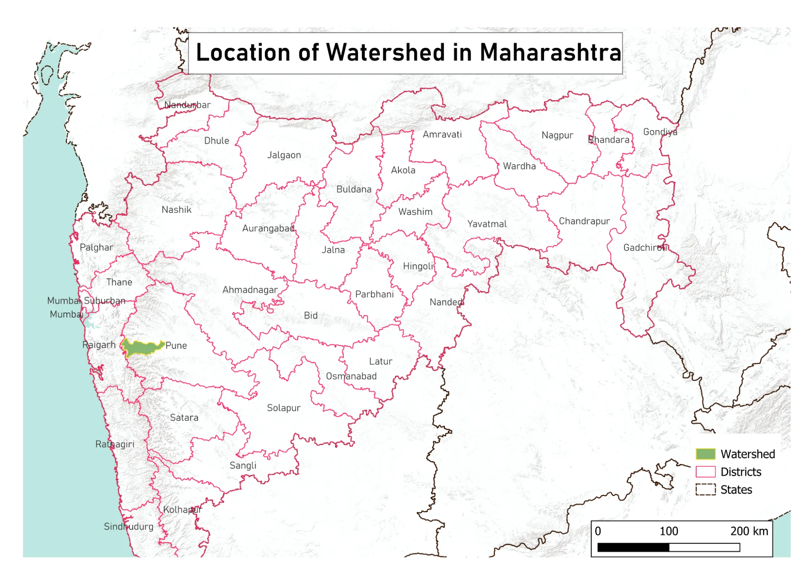
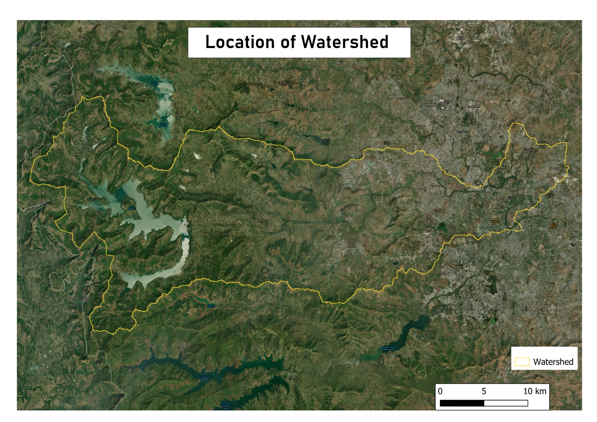
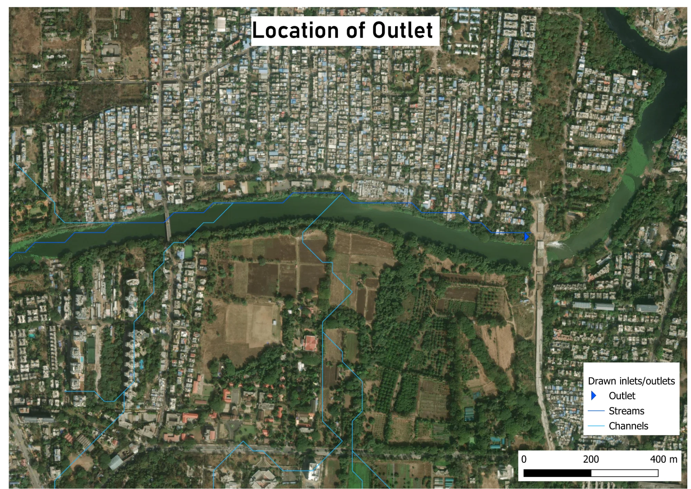
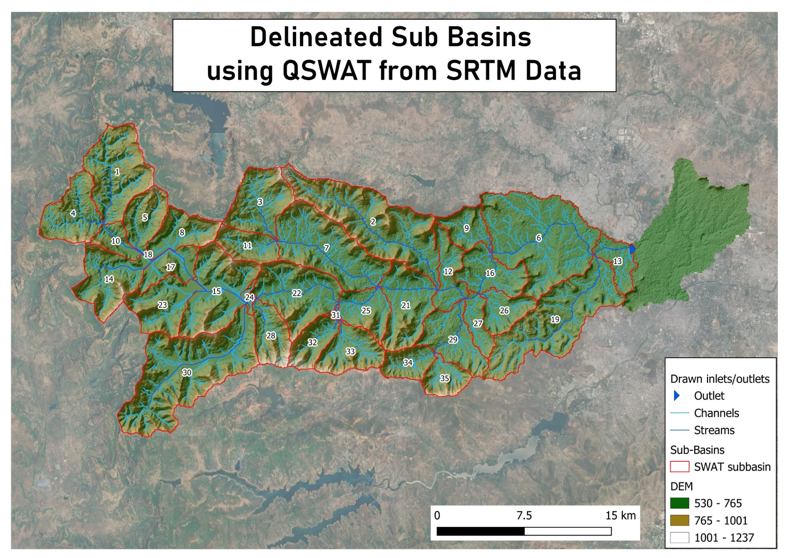
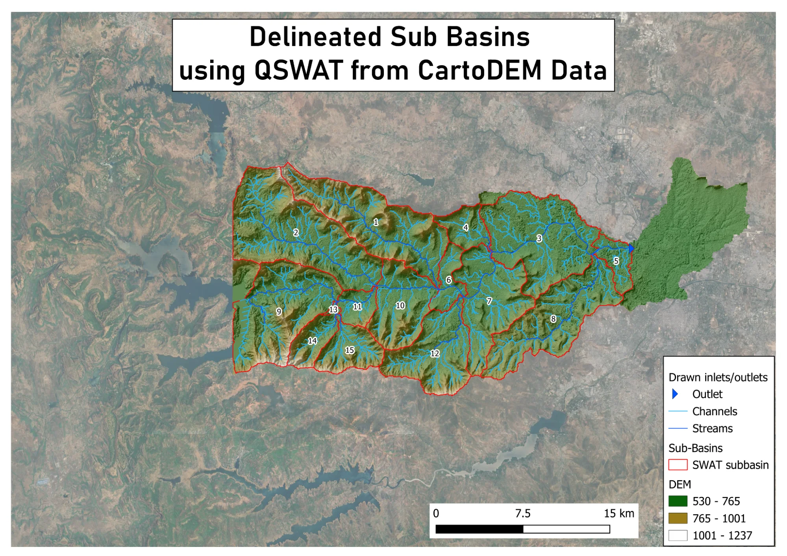
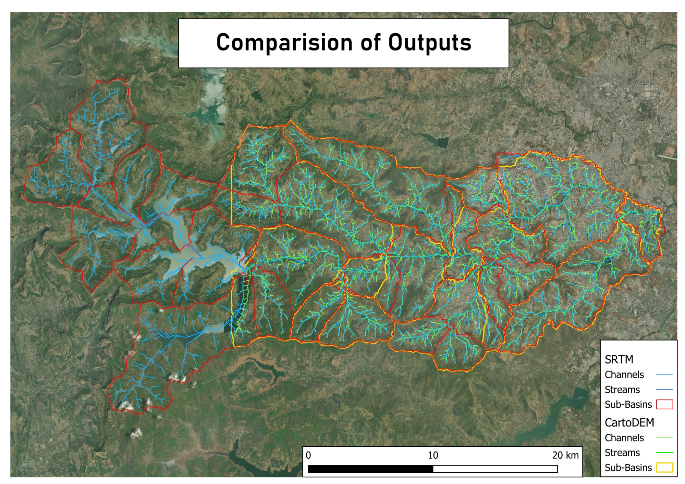
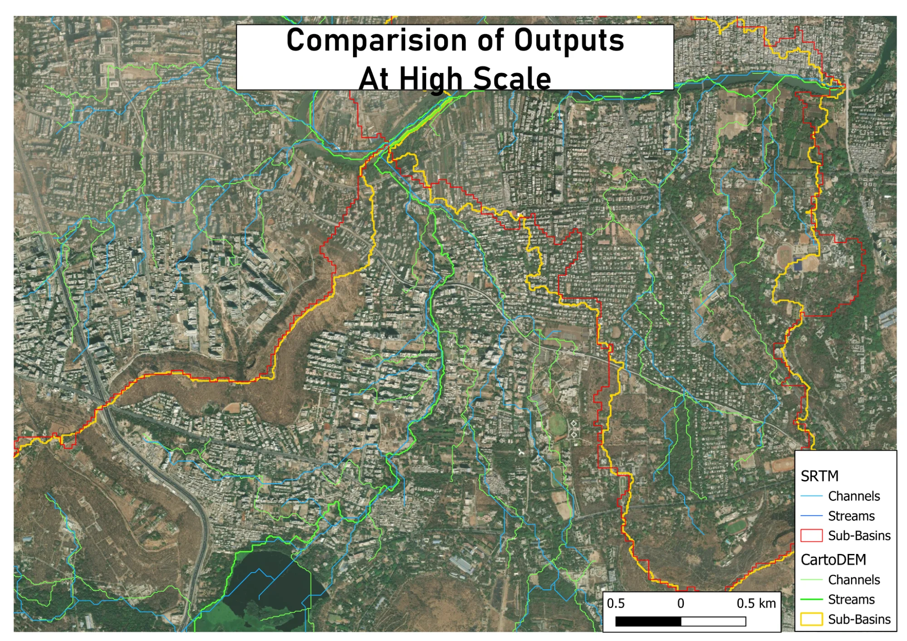
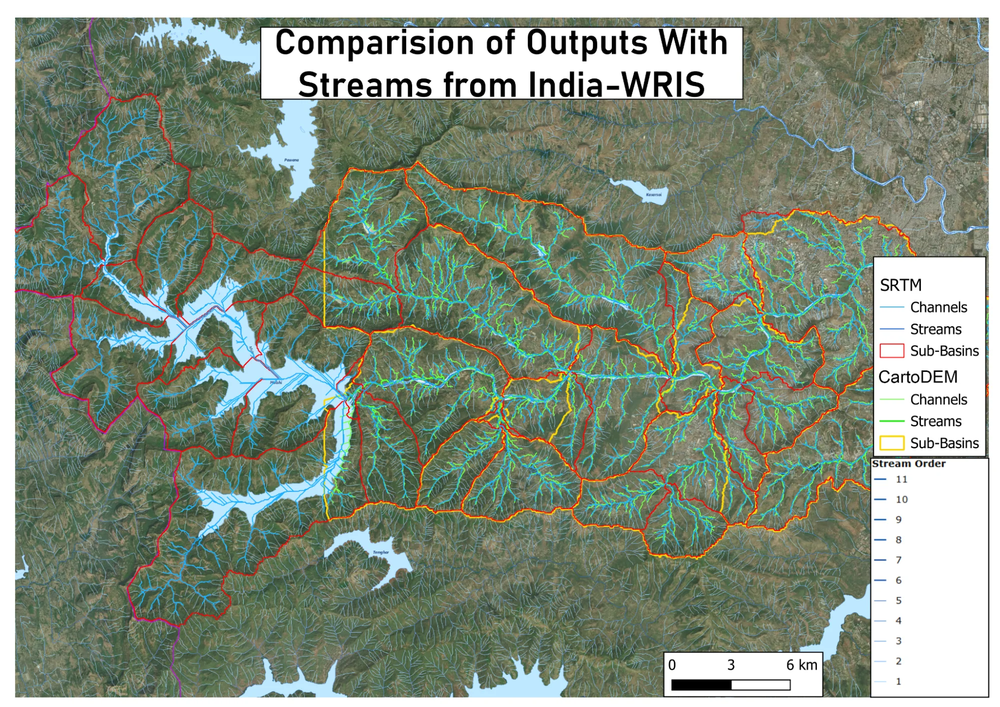



# Comparison of Watershed Delineation Using SRTM and CartoDEM in QSWAT+: A Case Study of the Mula River Basin

Accurate watershed boundaries and stream networks are essential for flood risk assessment, drainage planning, and water resource management. The quality of these outputs depends on the input elevation data. This case study compares two elevation datasets of different resolutions and vintages to assess their outputs for a watershed in Western Maharashtra.

## Study Area

The Mula River watershed is located in Mulshi and Haveli Talukas of Pune District (Fig. 1). The area includes the Mulshi Reservoir upstream and a mix of rural and urban land cover, providing a good test for stream generation accuracy across different terrain types (Fig. 2).

  

<em>Fig. 1. Location of the watershed in Maharashtra.</em>

  

<em>Fig. 2. Satellite view of the Mula River watershed. The study area spans from Mulshi Reservoir in the west to urban Pune in the east.</em>

## Method

QGIS and the QSWAT+ plugin were used to generate stream networks and delineate sub-basins from two elevation sources:

| Dataset | Resolution | Source | Vintage |
|---|---|---|---|
| SRTM (USGS) | ~30 metres | USGS Earth Explorer | 2003 |
| CartoDEM (ISRO) | 10 metres | ISRO NRSC | 2018 |

<em>Table 1: Elevation datasets used in the analysis</em>

Both datasets were processed using identical parameters. A barrage on the Mula River served as the outlet point (Fig. 3). Outputs were compared against each other and validated against India-WRIS stream data. Getting both datasets required reprojecting to an appropriate coordinate system (UTM 43 N). Using Warp to reproject to EPSG:32643 allowed processing through QSWAT+, as it requires units to be linear.

  

<em>Fig. 3. Location of outlet.</em>

> **Note:** The CartoDEM coverage available for study purposes does not extend to the full watershed boundary. The western portion near Mulshi Reservoir is outside CartoDEM coverage. This limits direct comparison of sub-basin counts between the two datasets.

Both Digital Elevation Models (DEMs) were clipped to the watershed boundary using QGIS. The QSWAT+ plugin was used for stream generation and watershed delineation with the following settings, which were identical for both datasets to enable comparison:

- **Flow direction:** D8 algorithm (TauDEM)
- **Sink filling:** Automatic (TauDEM pit removal)
- **Stream burning:** Not applied
- **Channel threshold:** 50 acres
- **Stream threshold:** 2,500 acres

These values were selected through iterative testing to produce stream networks that visually aligned with satellite imagery (ESRI World Imagery via QuickMapServices). A formal sensitivity analysis was not conducted.

## Findings

The number of delineated sub-basins differed between datasets: SRTM produced 35 sub-basins while CartoDEM produced 15. This difference is largely due to CartoDEM's spatial coverage being available for the eastern portion of the catchment, whereas SRTM DEM coverage was available for the whole catchment. Therefore, a comparison analysis was done within the area covered by both datasets. It was observed that higher-order streams aligned well. However, differences were noted in lower-order tributaries and sub-basin boundaries.

  

<em>Fig. 4. Sub-basins delineated using SRTM data (35 sub-basins).</em>

  

<em>Fig. 5. Sub-basins delineated using CartoDEM data (15 sub-basins). The western portion of the watershed is outside CartoDEM coverage.</em>

In urban areas east of Mulshi, CartoDEM outputs aligned more closely with current satellite imagery. This likely reflects two factors: (i) CartoDEM's higher spatial resolution (10m versus 30m spatial resolution of SRTM DEM), which allows finer terrain detail to be captured, and (ii) the more recent CartoDEM acquisition (2018) compared with the SRTM DEM acquisition (2003). Therefore, Cartosat DEM represents current land surface conditions in areas that have urbanised over the past two decades.

  

<em>Fig. 6. Comparison of SRTM and CartoDEM outputs. The western portion of the watershed is outside CartoDEM coverage.</em>

  

<em>Fig. 7. Comparison in urban areas. Blue/cyan: SRTM outputs. Green/yellow: CartoDEM outputs. The higher-resolution CartoDEM better captures drainage patterns in built-up areas.</em>

India-WRIS is authoritative data from the Ministry of Water Resources. It uses a lower drainage initiation threshold in comparison to the thresholds used in this analysis, resulting in a denser stream network. Visual comparison of such a denser stream network requires stereo image analysis, whereas this study used high-resolution satellite imagery such as ESRI World Imagery, accessed via the QuickMapServices plugin, which does not allow verification of detailed stream networks such as the India-WRIS portal.

  

<em>Fig. 8. Comparison with India-WRIS stream data. India-WRIS streams shown by stream order.</em>

## Limitations

- CartoDEM coverage does not match the full watershed extent, limiting direct comparison
- Threshold values were not optimised separately for each DEM resolution
- Validation was carried out using visual image interpretation only. No field verification or quantitative accuracy assessment was conducted

## Conclusion

For the overlapping coverage area, it was observed that CartoDEM outputs are aligned better with current satellite imagery than SRTM, particularly in urban areas. This reflects the advantages of CartoDEM's higher resolution and more recent vintage over the SRTM DEM, making it more suitable for delineating streams and watersheds in rapidly changing landscapes. This finding is specific to this study area and does not imply that optical DEMs are generally more suitable than radar DEMs for hydrological analysis.

This case study highlights that QGIS and QSWAT+ provided an effective open-source platform for this comparison, enabling the same workflow to be applied to both datasets systematically.

## Resources

- QSWAT+ documentation: [https://swatplus.gitbook.io/docs/user/qswat+](https://swatplus.gitbook.io/docs/user/qswat+)
- SRTM data: [https://earthexplorer.usgs.gov](https://earthexplorer.usgs.gov)
- India-WRIS: [https://indiawris.gov.in/wris/#/geoSpatialData](https://indiawris.gov.in/wris/#/geoSpatialData)
- CartoDEM: [https://bhuvan.nrsc.gov.in](https://bhuvan.nrsc.gov.in)

## Author

[Chinmay Shaligram](https://www.linkedin.com/in/chinmayshaligram/) is the Co-Founder of [Terra Helix](https://terrahelix.io/), a geospatial consultancy based in Pune, India.


