

# Stop Downloading - Design Custom Maps in QGIS with OSM Vector Tiles

Traditional GIS trained us to download data first and design later. Vector tiles reverse that logic. This tutorial helps you design custom maps using OpenStreetMap (OSM) Vector Tiles, without actually downloading the data locally. We all know that OSM data is one of the best free and comprehensive sources of geodata, easily available as open-access data. Since it is comprehensive, the data size is large and downloading and preprocessing it can be tedious and time-consuming. You may need to download and preprocess each layer (such as roads, buildings, etc) separately before starting the actual cartography. This is often hectic, storage-heavy and not feasible for creating a quick map. Instead, OSM vector tiles help you stream the data and create custom maps according to your style without actually downloading data. Moreover, instead of downloading data of large areas, you only stream the data for the area you need.

For a better understanding of the Tile Service, Vector Tiles and their advantages, it is recommended to read the blog ["Understanding Base Maps, Tile Services and Vector Tiles"](https://arkives.in/posts/02/2026/understanding-base-maps-tile-services-and-vector-tiles/).

## Getting the Data

In this tutorial, we will create a map of roads for the Palakkad Municipality in Kerala using the OSM Vector Tiles. In case you want to use the Palakkad Municipality boundary file, you can download the GeoPackage file [here](https://github.com/qgis/QGIS-UG-India/releases/download/data/Palakkad_Municipality.gpkg) or use any boundary of your choice.

In case you need to download vector administrative boundaries from OSM, there are multiple ways to do so (see e.g. [tutorial 1](https://arkarjun.medium.com/deriving-vector-layers-of-administrative-boundaries-from-openstreetmap-4c94a96ddd58) or [tutorial 2](https://arkives.in/posts/01/2021/downloading-vector-data-from-osm/)).

## Setting Up

We are using the Official OSM Foundation-supported vector tiles - [Shortbread](https://shortbread-tiles.org) for this purpose. The advantage of using Shortbread is that you can access the most up-to-date data in OSM as this data gets updated almost every minute. Hence, if you find any errors in the data, you can correct them in OSM and get the updated map streamed directly as vector tiles.

Let us set up the vector tiles first. Go to **Layer → Add Layer → Add Vector Tile Layer**.

  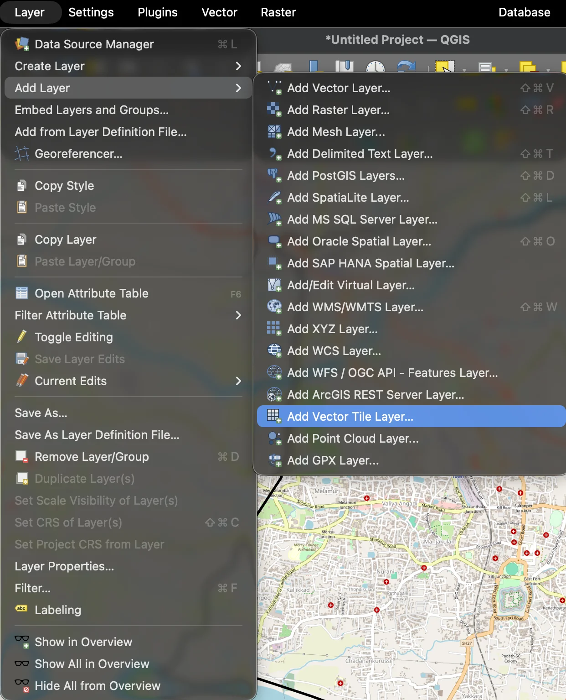

Add a **New Generic Connection** from the dialogue box and fill in the following details:

  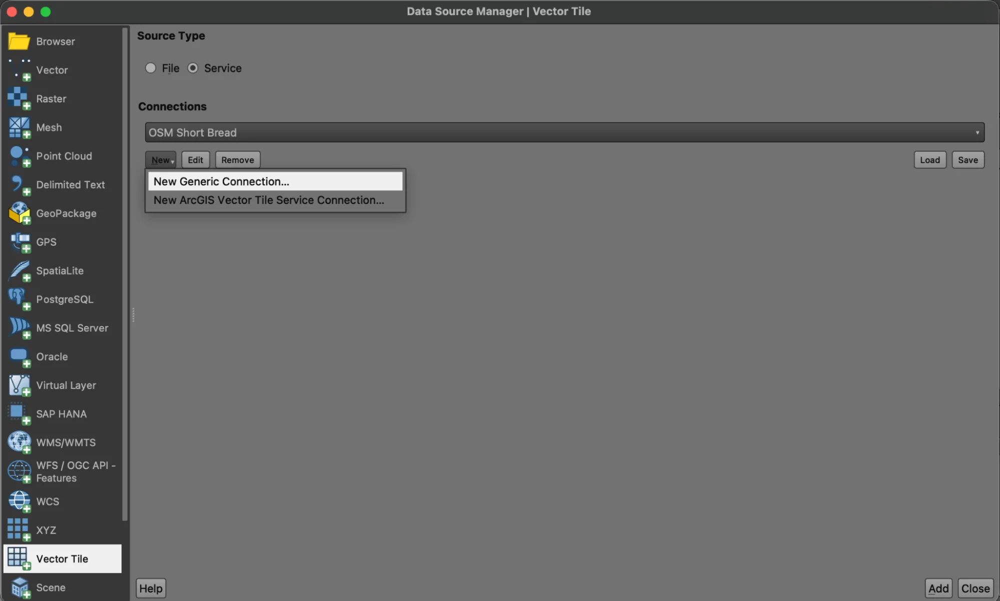

- **Name**: OSM Shortbread (or anything of your choice)
- **URL**: `https://vector.openstreetmap.org/shortbread_v1/{z}/{x}/{y}.mvt`
- **Min Zoom**: 0
- **Max Zoom**: 14

  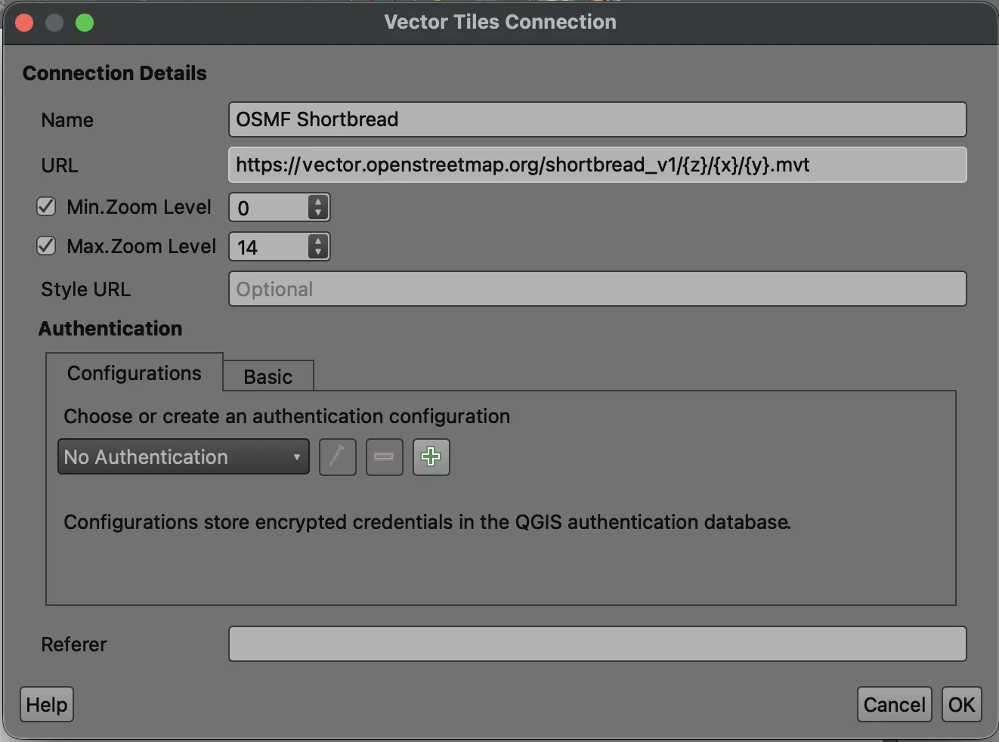

Once you add the details and click **OK**, you can see the connection in the drop-down option, ensuring you have added the Shortbread Vector Tile connection.

  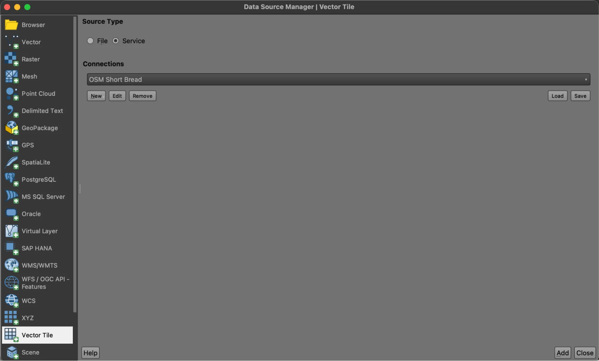

In order to close the window, click on **Close**.

At this point, you can also add a basemap of your choice. In case you have not done so, install the QuickMapServices plugin. Open the Plugins Manager by navigating to **Plugins → Manage and Install Plugins** and install the **QuickMapServices (QMS)** plugin.

In order to use the OSM Standard base map, do the following: **Web → QuickMapServices → OSM → OSM Standard**. Once added, you can see the OSM Basemap added to your layer panel and the map is visible in your map canvas.

  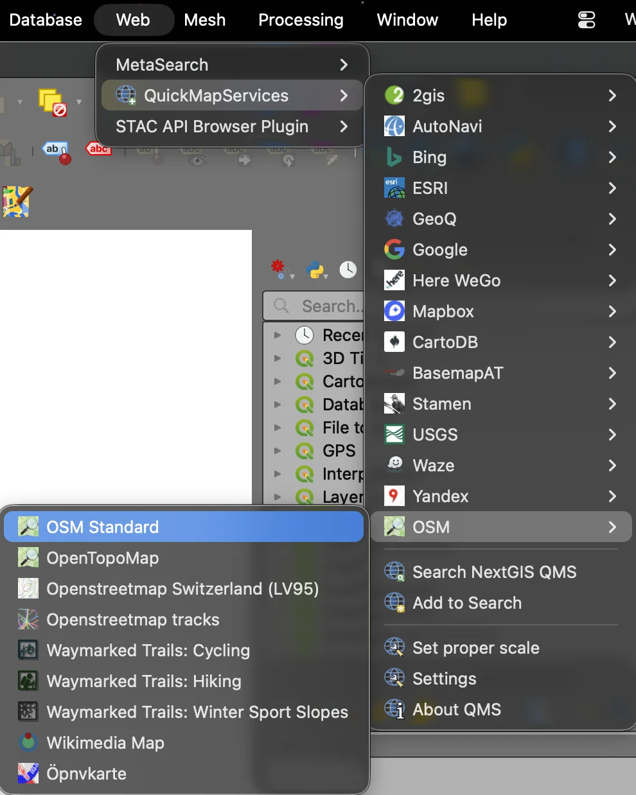

## Loading the Vector Tile Layer

Now that you have all the necessary setup done, let's get into the actual cartography using vector tiles. Using the OSM basemap, zoom into your location of interest. Alternatively, you can upload a vector file of a region of your choice. In this tutorial, we use a GeoPackage file for the Palakkad area using **Layer → Add Layer → Add Vector Layer**. Instead, you can also drag this file to the QGIS canvas. To zoom to the Palakkad boundary area, right-click on the layer and click on **Zoom to Layer(s)**.

Style your newly added boundary layer by right-clicking on the Palakkad_Municipality vector layer → **Properties → Symbology**. Here, the style **Outline Red** is chosen. After selecting the style, click on **Apply**.

Add the Vector Tile Layer from the Add Layer option (**Layer → Add Layer → Add Vector Tile Layer**), select the **OSM Shortbread** from the dropdown option and click on **Add**.

  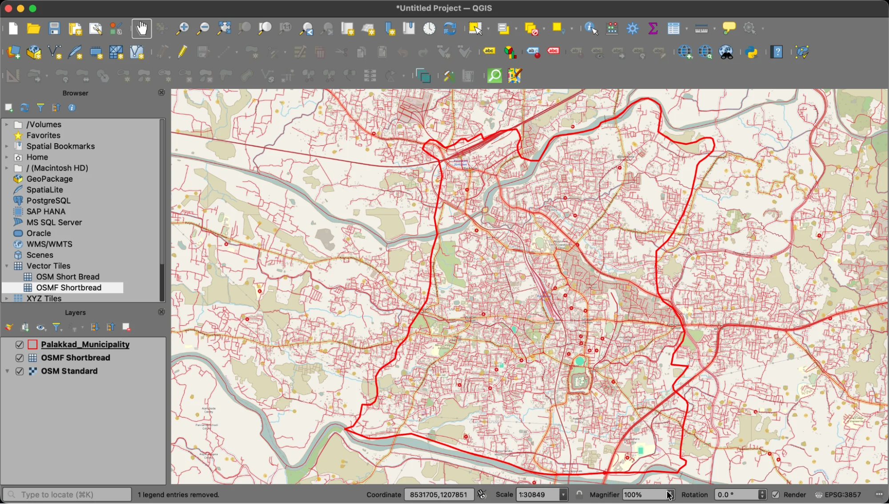

You will see the Vector Tile layer added to your layers panel as a new layer, with the features loaded in some default style.

## Styling the Vector Tile Layer

You might have noticed that, unlike normal layers, the vector tile layer is loaded as a single layer comprising lines, polygons, and points. Hence, to understand the data, you need to have an idea of the OSM tagging system. The Vector Tile schema is a subset of the OSM tagging schema. Detailed documentation of the vector tile schema is available [here](https://shortbread-tiles.org/schema/1.0/).

Open the Symbology of the Vector Tile layer (Right-click on the OSM Shortbread layer → **Properties → Symbology**). You can see the basic Symbology applied for Polygons, Lines and Points. Let's try customising our symbology by adding a custom symbol for the roads.

  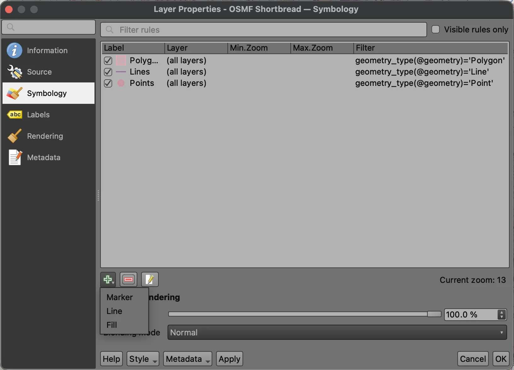

Add new Symbology by clicking on the **[+]** icon at the bottom and selecting **Line** (as we are dealing with road data). Additionally, other options you can explore are **Marker** for point features and **Fill** for area features.

Subsequently, add the following in the corresponding fields:

- **Label**: Roads (This can be anything of your choice to distinguish)
- **Layer**: `streets` (Streets is the tag for roads as per the schema documentation)
- **Min Zoom and Max Zoom**: Leave empty to apply for all zoom levels
- **Filter**: `geometry_type(@geometry)='Line'` (to filter line geometries only). You can add additional filters using logical operators `AND` or `OR` for further filtering — for example, `AND kind = 'primary'` to select only primary highways.

Click on **Apply** and then **OK**.

  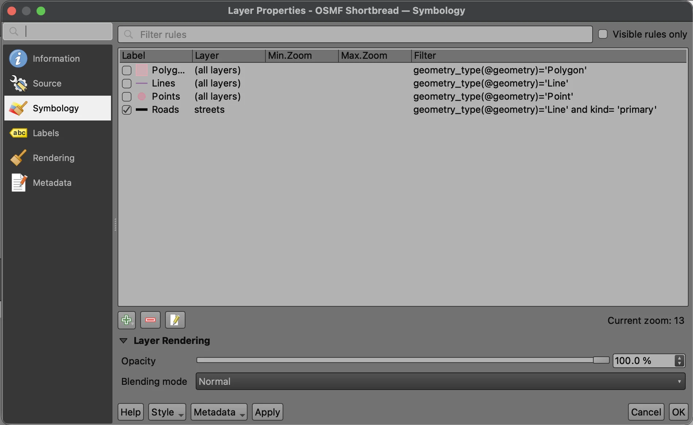

You can add any number of rules from the Shortbread Vector Tile schema and style them as needed. In order to style the Roads rule, double-click on the line symbol (second column) to open the styling window. Here, the line width is increased and the colour is changed to black. Click on **Apply** and **OK**.

  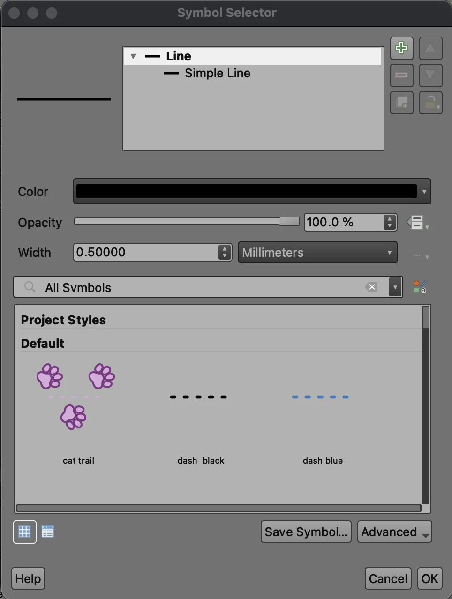

If you are new to styling or need help, refer to the [Styling Tutorial](https://www.qgistutorials.com/en/docs/3/basic_vector_styling.html). You can also import from an already saved style using the **Load Style** option from the **Style** menu at the bottom. You can also toggle each rule's visibility by checking and unchecking the boxes associated with it.

With the Roads rule switched on along with the OSM Shortbread layer and the OSM Standard basemap, you should see something as shown in the screenshot below. As you can observe, the roads are styled with a thick black line.

  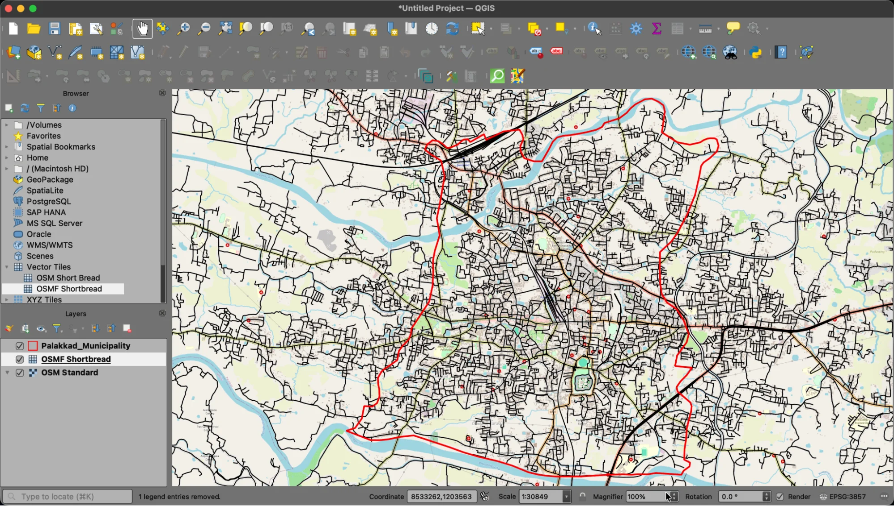

If you have not set the zoom levels while creating the filters, the zoom level and visibility are automatically adjusted while zooming in or out. You can refer to the schema documentation to know the features and their applicable zoom levels.

## Exporting the Map

### 1. Creating the Print Layout

Before creating the print layout, ensure that only the Vector Tile layer and the Palakkad Municipal layer are switched on in the QGIS canvas. Next, click on **Project → New Print Layout** and enter a unique print title in the small window (e.g. `OSMF_palakkad`).

In the Print Layout menu, go to **Add Item → Add Map**. Hold the left mouse button and draw the desired size of your map.

  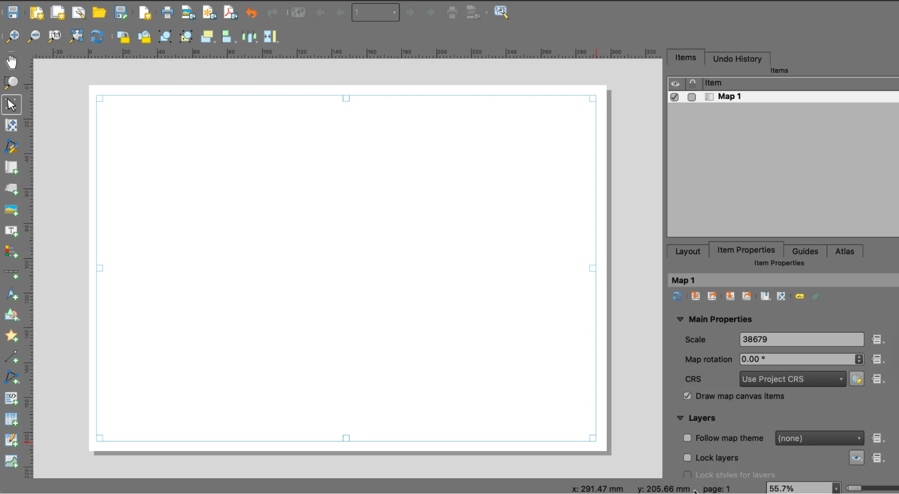

Upon completion, the map will be rendered with the layers which are toggled on in the main QGIS project window (the OSM Shortbread and the Palakkad Municipality layer only).

  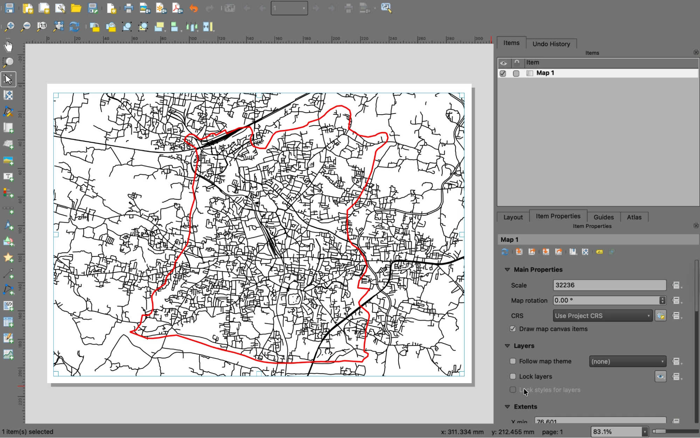

### 2. Clipping to the Area of Interest

The above option allows you to export the map within a rectangular extent only. It is not possible to clip a vector tile layer with another vector layer directly in the QGIS canvas — you can only restrict the layers within the boundary by masking it using Atlas.

If you are new to map-making using the Atlas tool, refer to [tutorial-1](https://docs.qgis.org/3.40/en/docs/training_manual/forestry/forest_maps.html) or [tutorial-2](https://www.qgistutorials.com/en/docs/3/automating_map_creation.html).

Enable the Atlas settings from the Menu (**Atlas → Atlas Settings**).

You will find the Atlas tab visible in the side panel on the right. Enable the **Generate an Atlas** option on the side panel. Under the **Configuration** tab, select the boundary file you want to clip the vector tile with.

  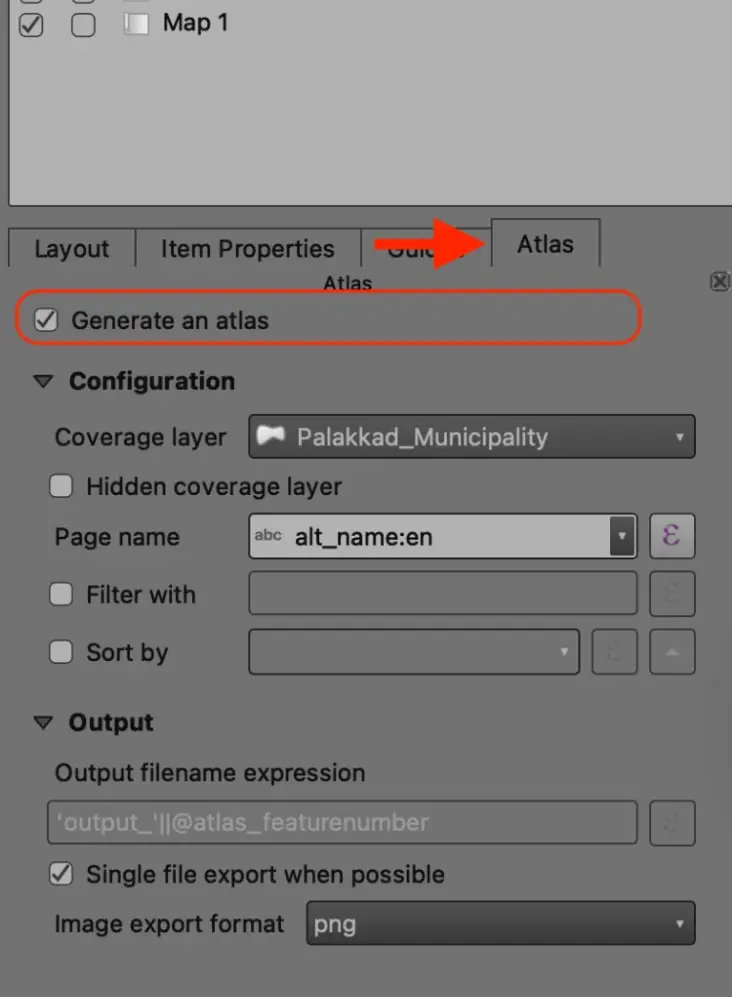

After enabling the Atlas and Configuration, navigate to the **Item Properties** tab in the side panel and click on the **Clipping settings** icon (as highlighted in the figure below).

  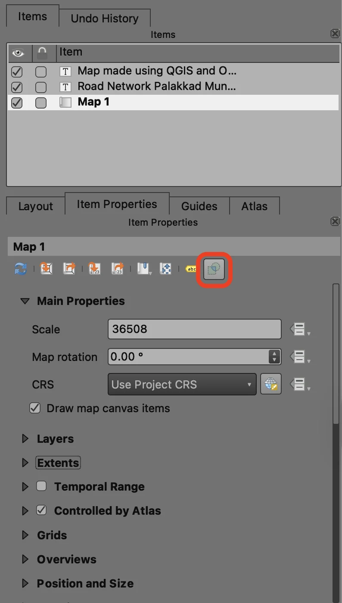

In the **Clipping Settings**, enable the option **Clip to atlas feature**. Also, choose **Clip selected layers** and select the Shortbread Vector Tile Layer from the list below by checking the box.

  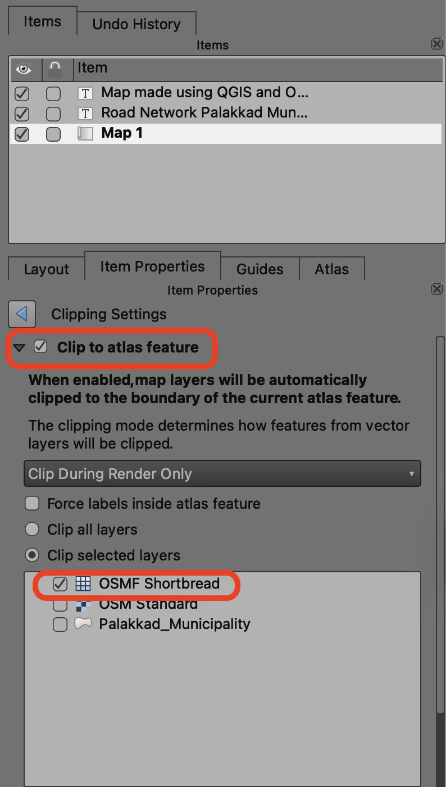

Click on the **Preview Atlas** icon on the top. Go back to the **Item Properties** of the Map and click the **Update Map Preview** icon, and validate the preview.

  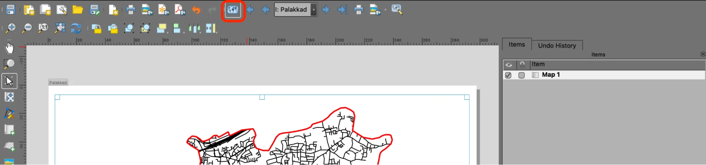

Add required map elements such as north arrow, legends, title, etc., from the **Add Item** menu. Since making a complete map is beyond the scope of this tutorial, you can refer to this detailed [tutorial](https://www.qgistutorials.com/en/docs/3/making_a_map.html).

  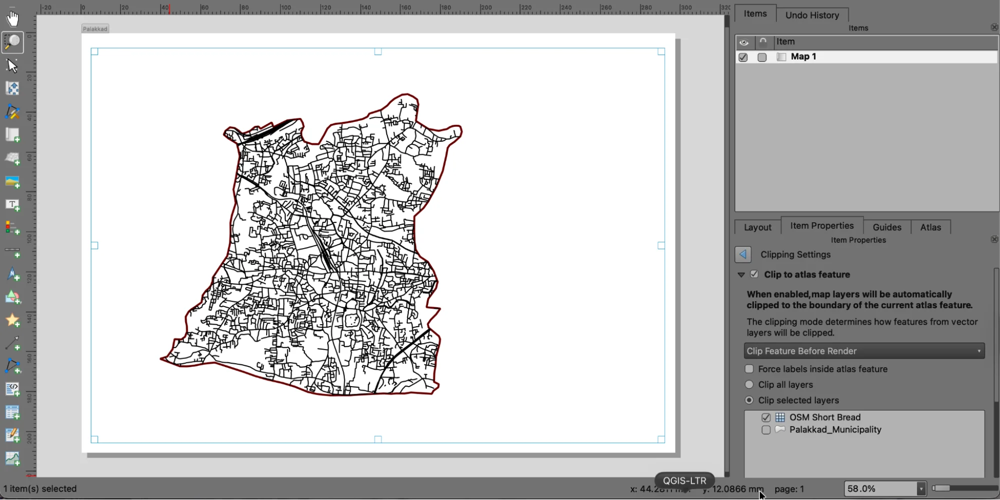

> **Note**: Using **Add Legend** to add a legend for roads is currently not possible with vector tiles. This is still an [open QGIS GitHub issue](https://github.com/qgis/QGIS/issues/59628). As an alternative, you can take a screenshot of the symbology window of the vector tile (Right-click on the OSM Shortbread layer → **Properties → Symbology**).

  

Crop it to the required text and symbol and add it as an image in the Print Canvas using **Add Item → Add Picture**, then choose your image from the options in the side panel.

  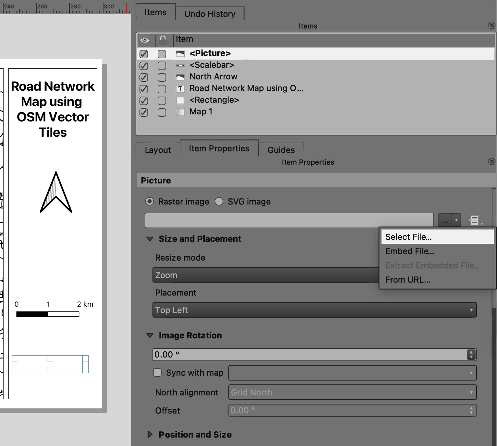

Use the **Export** option to save the map as an image, PDF, or SVG. Here is the final road network map created using the OSM Vector Tile data in QGIS.

  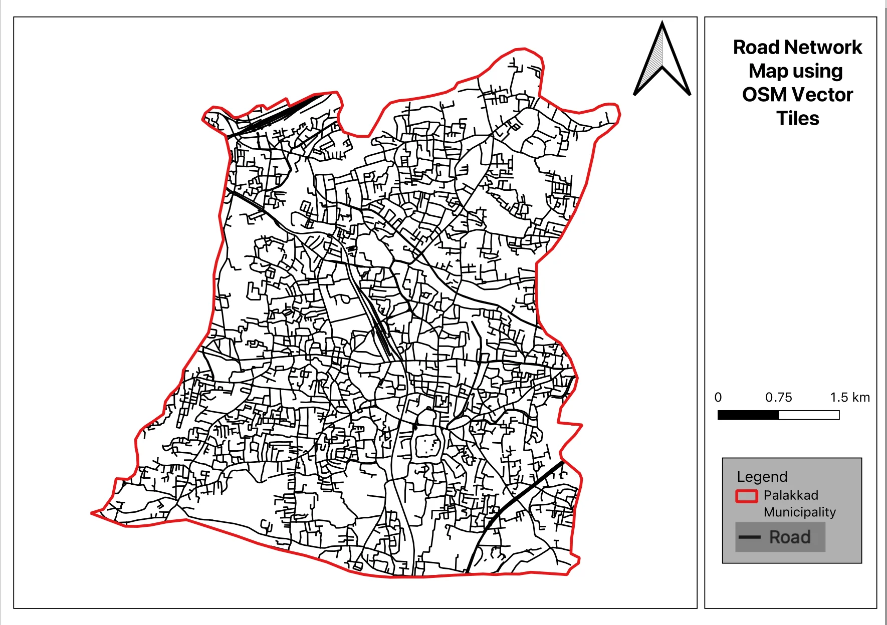

To make it more attractive, one can experiment further with styling. Below, the same map is styled in black and white.

  

## Author

[Ark Arjun](https://arkives.in/) is a geospatial professional and an OpenStreetMap Volunteer from Kerala.


