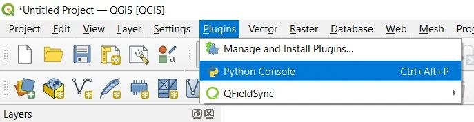
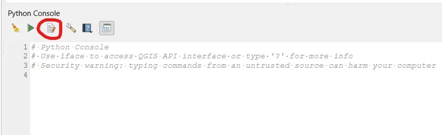
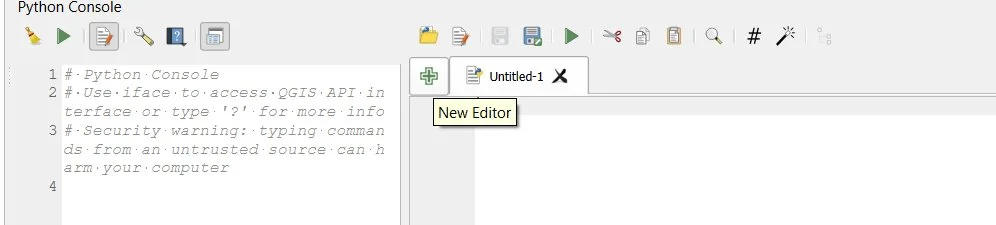
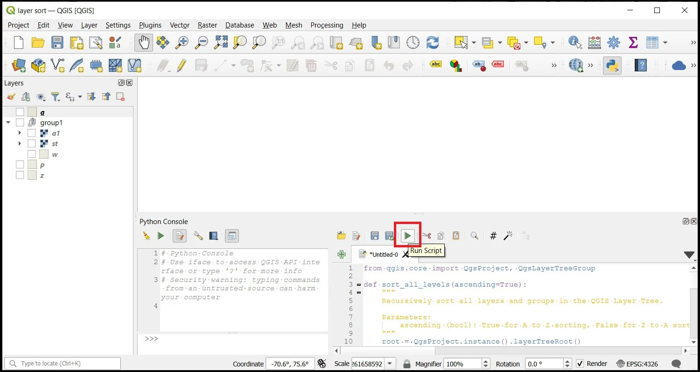
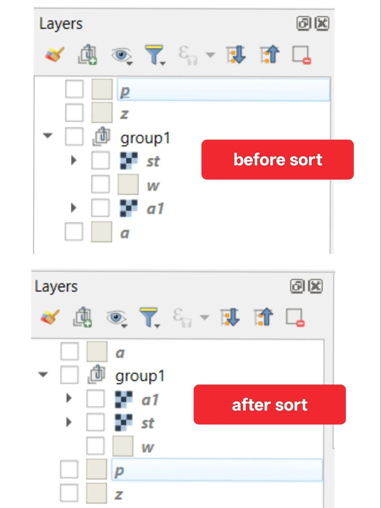
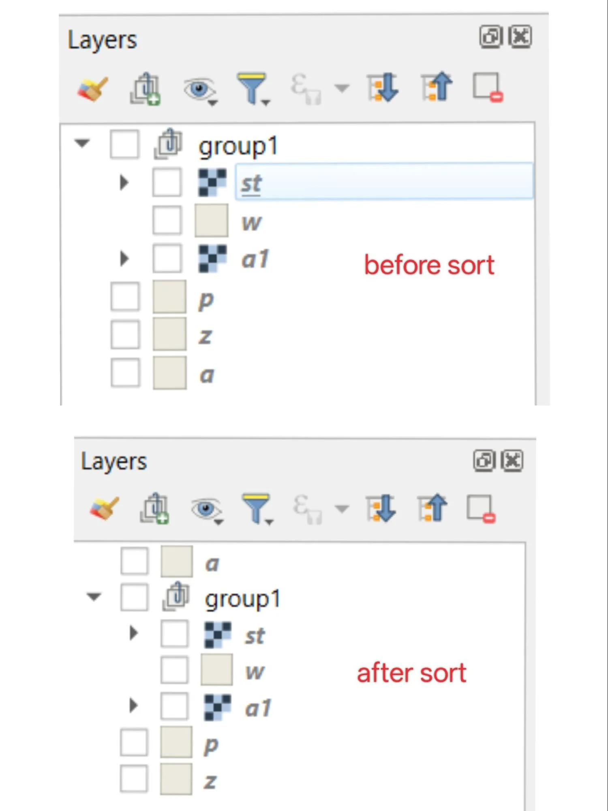
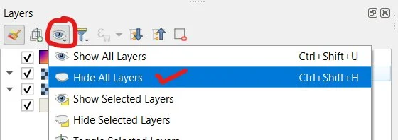



# Sorting Layers Alphabetically in QGIS Using PyQGIS

In QGIS, layers and groups can be arranged manually in the Layer Panel. When a project contains many layers, manual arrangement becomes time-consuming. Using the Python Console, we can automatically sort layers alphabetically.

**QGIS Version:** 3.40.9-Bratislava, 3.34.0-Prizren

This tutorial explains two specific approaches:

1. **Sorting All Levels:** Includes groups and all nested subgroups.
2. **Sorting Top Level Only:** Only sorts layers and groups visible at the highest level.

Both scripts only change the Layer Panel order. They do not modify layer data, symbology, or styles.

## How to Open the Python Console

To use these scripts, you must use the internal QGIS Python Console.

1. Go to the top menu and select **Plugins** > **Python Console** (or press `Ctrl + Alt + P`).
2. Once the console opens at the bottom of your screen, click the **Show Editor** icon (the small notepad icon in the console toolbar).
3. A blank white panel will appear on the right. This is where you will paste the code.

<p align="center">
  
</p>

<p align="center">
  
</p>

<p align="center">
  
</p>

## Part 1: Sort All Levels (Hierarchical Layer Sort)

This version sorts everything in the Layer Panel, including the root level, all groups, and any nested subgroups. It works recursively, meaning it enters each group, sorts its contents, and then moves to the next.

### The Code

```python
import re
from qgis.core import QgsProject, QgsLayerTreeGroup

def sort_all_levels(ascending=True):
    """
    Recursively sort all layers and groups in the QGIS Layer Tree.
    Parameters:
        ascending (bool): True for A to Z sorting, False for Z to A sorting.
    """
    root = QgsProject.instance().layerTreeRoot()

    def natural_key(node):
        # Breaks name into parts to sort numbers as integers (Case-Insensitive)
        name = node.name().lower()
        return [int(c) if c.isdigit() else c for c in re.split(r'(\d+)', name)]

    def sort_container(container):
        # Take a snapshot of child nodes to avoid modification issues
        nodes = list(container.children())

        # Sort nodes using natural sorting logic
        sorted_nodes = sorted(
            nodes,
            key=natural_key,
            reverse=not ascending
        )

        # Reinsert nodes in sorted order using clone to ensure API compatibility
        for i, node in enumerate(sorted_nodes):
            node_clone = node.clone()
            container.insertChildNode(i, node_clone)
            container.removeChildNode(node)

            # Recursively sort nested groups
            if isinstance(node_clone, QgsLayerTreeGroup):
                sort_container(node_clone)

    # Start sorting from the project root
    sort_container(root)


# Execute sorting (set ascending=False for Z to A order)
sort_all_levels(ascending=True)

print("Layer tree organization complete.")
```

<p align="center">
  
</p>

### How It Works

- The function accesses the project layer tree root.
- It collects all children nodes.
- Nodes are sorted alphabetically using **case-insensitive** name comparison.
- Each node is cloned and reinserted at its correct sorted index position.
- If a node is a group, the function calls itself again to sort inside that group.

<p align="center">
  
</p>

## Part 2: Sort Only Top Level (Flat Sort)

This version sorts only what is directly under the root. It moves layers and entire groups as single blocks. It does not change the internal order of layers inside those groups.

### The Code

```python
import re
from qgis.core import QgsProject

def sort_top_level_only(ascending=True):
    """
    Sort only the top-level layers and groups in the QGIS Layer Tree.
    Parameters:
        ascending (bool): True for A to Z sorting, False for Z to A sorting.
    """
    root = QgsProject.instance().layerTreeRoot()

    # Take a snapshot of top-level nodes
    nodes = list(root.children())

    def natural_key(node):
        # Breaks name into parts for numerical comparison (Case-Insensitive)
        name = node.name().lower()
        return [int(c) if c.isdigit() else c for c in re.split(r'(\d+)', name)]

    # Sort nodes by natural name order
    sorted_nodes = sorted(
        nodes,
        key=natural_key,
        reverse=not ascending
    )

    # Reinsert nodes at correct positions
    for i, node in enumerate(sorted_nodes):
        node_clone = node.clone()
        root.insertChildNode(i, node_clone)
        root.removeChildNode(node)

# EXECUTION
sort_top_level_only(ascending=True)

print("Top-level layer tree organization complete.")
```

### How It Works

- The script collects only root level children.
- It sorts them alphabetically.
- Each node (whether a layer or a group) is cloned and moved to the top.
- Groups remain unchanged internally, preserving your manual sub-organisation.

<p align="center">
  
</p>

## Important Notes

These scripts are designed for safety:

- They **do not** modify original data sources on your hard drive.
- They **do not** change symbology, colours, or labelling.
- They **do not** break layers or corrupt project files.
- They only reorganise the visual "Table of Contents" in the Layer Panel.

### Visibility Warning

In QGIS, layers higher in the Layer Panel are rendered above lower layers in the map canvas. If an alphabetical sort moves a large Satellite Raster to the top, it may cover up your points and lines. You can simply drag the raster back to the bottom of the list if this occurs.

## How to Save These Scripts

Saving your scripts allows you to use them again in any future project without re-typing or re-pasting.

1. In the **Python Console Editor** where you pasted the code, click the **Save** icon (diskette icon).
2. Choose a folder on your computer and name your file (for example: `sort_all_layers.py`).
3. In the future, you can click the **Open Script** icon (folder icon) in the Python Console to load the file instantly.
4. Once loaded, simply click the green **Run Script** arrow to apply the sort.

## Pro Tip: Boost Execution Speed

If your project contains numerous **Raster** or **WMS (Web Map Service)** layers, the software will attempt to re-render the entire map canvas every time your code makes a change. This can cause significant lag.

**To run your code faster:**

1. Click the **Visibility** (eye) icon in the Layers panel.
2. Select **Hide All Layers** (or use `Ctrl+Shift+H`).
3. Run your script/tool.

<p align="center">
  
</p>

By disabling the live render, you free up your GPU and RAM to focus entirely on processing the data rather than drawing pixels. Once the code finishes, simply toggle the layers back on.

## PyQGIS API: Under the Hood

The QGIS Python API (PyQGIS) allows you to programmatically control the **Layer Tree**, which is the internal "Table of Contents" for your project. You are manipulating a visual hierarchy that follows this structure:

<p align="center">
  
</p>

### Key Classes and Methods

The following components are the building blocks used in the tutorial to reorganize the structure safely while keeping all underlying spatial data and styling intact.

| Component | Purpose |
|---|---|
| `QgsProject` | The central class represents the active QGIS project. |
| `layerTreeRoot()` | A method used to access the very top (root) of the layer hierarchy. |
| `QgsLayerTreeGroup` | A class that identifies folders/groups to allow for recursive sorting. |
| `children()` | Retrieves a list of all layers and groups inside a container. |
| `name()` | Obtains the name of a layer or group for alphabetical comparison. |
| `clone()` | Safely duplicates a node before moving it to a new position. |
| `insertChildNode()` | Inserts a node into a specific index in the list. |
| `removeChildNode()` | Removes the original node after the clone is successfully placed. |

### Why use `.clone()`?

In the provided scripts, the `.clone()` method is used to ensure maximum compatibility with the QGIS API. By creating a duplicate of the node, the script can reposition it within the hierarchy and then delete the original reference, effectively "moving" the layer without losing its properties.

## Conclusion

Using PyQGIS scripts is an efficient way to automate repetitive layer management tasks in large projects, significantly reducing manual effort in complex spatial workflows. The recursive and flat sort approaches demonstrated in this tutorial help maintain a clean and organised Layer Panel while preserving all underlying spatial data, symbology, and styles. By understanding these foundational classes and methods, you can extend similar techniques to automate many other project management tasks in QGIS.

## Author

[Sudarshan Bhoyar](https://www.linkedin.com/in/sudarshan-bhoyar) is the Founder of [Deccan Spatial](https://deccanspatial.com/) and author of "Soil Spectral Analysis in R".


