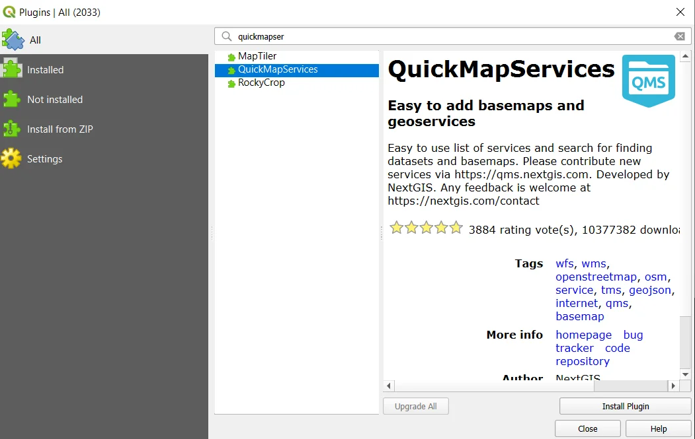
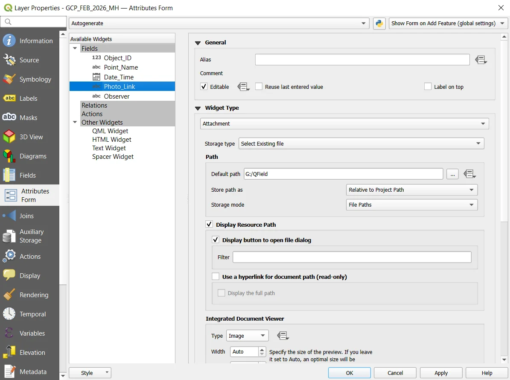
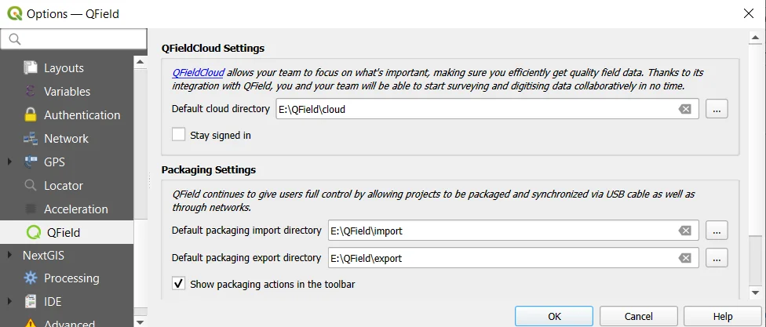
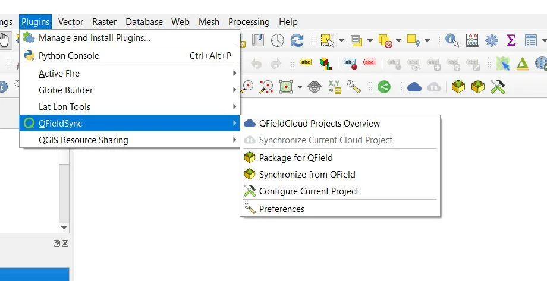



# Private & Replicable Field Data Collection with QGIS and QField

In the geospatial landscape, we often face two major hurdles: unreliable internet connectivity in remote areas and the need for strict data privacy. Whether you are conducting surface soil sampling, marking Ground Truth Points (GTP) for remote sensing, or documenting rural infrastructure, you need a workflow that is field-hardened.

Today, we are exploring a 100% private, manual transfer workflow. This method involves no cloud subscriptions and ensures no data leaves your device. This tutorial demonstrates a professional-grade field data collection procedure using QGIS and QField.

## Setting Up the Desktop Environment

Before creating your project in QGIS, you must install the necessary tools in QGIS to handle base mapping and mobile synchronisation.

### 1. Required Plugins

Open the Plugins Manager by navigating to **Plugins -> Manage and Install Plugins** and install the following:

- **QuickMapServices (QMS)**: This provides access to high-resolution satellite imagery and basemaps.
- **QField Sync**: This plugin manages the configuration and packaging of QGIS projects for the QField mobile application.

  

### 2. Enabling High-Resolution Basemaps

To access very high resolution satellite imagery for India, such as Google Hybrid, you must enable the community-contributed pack:

- Navigate to **Web -> QuickMapServices -> Settings**.
- Open the **More Services** tab and click **Get Contributed Pack**.
- Click **Save**.
- To add a basemap, go to **Web -> QuickMapServices -> Google -> Google Hybrid**.

  

### 3. Create a Project Directory

Create a project folder on your local drive named QField (or any other name of your choice).

  

## Building Your Field-Ready Layer

For field data collection, such as GCP collection or surface soil sampling, your attribute table must be structured to ensure efficiency and data integrity. While this guide demonstrates a Shapefile workflow, GeoPackage (.gpkg) is recommended for modern professional field data collection systems.

### 1. Create the Shapefile (.shp)

Go to **Layer -> Create Layer -> New Shapefile Layer** and configure the following settings:

- **File Name**: Choose a clear name, such as `GCP_Feb2026_MH.shp` and save the file in the project directory you have just created.
- **Geometry Type**: Point.
- **Coordinate Reference System (CRS)**: Select **EPSG:4326 - WGS 84**.

> **Note**: WGS 84 is the native coordinate system for most mobile GNSS/GPS sensors. It ensures compatibility with native GNSS/GPS readings and reduces the complexity of on-the-fly transformations.

### 2. Define the Attribute Table

Defining attribute table fields is one of the crucial steps for efficient organisation of data. You may consider the following fields to ensure your data is clean when you return to the office:

- **Object_ID**: (Whole Number) Your primary key.
- **Point_Name**: (Text) Use labels like GCP_05 or Soil_A1.
- **Date_Time**: (Date) To track exactly when the sample was taken.
- **Photo_Link**: (Text) This stores the relative path to your geotagged image. Ensure the Photo_Link field length is at least 200 characters to accommodate long file paths.
- **Observer**: (Text) The name of the person on-site.

  

### 3. Configure the Photo Widget

To turn your phone into a professional data logger, go to **Layer Properties -> Attributes Form**. You can open this Attributes Form by right clicking on `GCP_Feb2026_MH.shp` and selecting "Properties" from the menu:

- Select the **Photo_Link** field.
- Set the **Widget Type** to **Attachment**.
- **Storage Mode**: Under **Default path**, choose the project directory you created above. Under **Store Path**, select **Relative to Project Path** and under **Storage Mode**, choose **File Paths**.
- **Integrated Document Viewer**: Select **Image** to view your sample photo directly in the app.

  

### 4. Configure Additional Attribute Widgets

Standardising data entry is vital for high-quality field collection. We must enforce strict rules to prevent empty values and ensure consistency across the dataset.

- **Object_ID (Primary Key)**: Select the **Object_ID** field and set the **Widget Type** to **Range**. Set a minimum of **1** and a maximum of **100,000**. Under **Constraints**, check the options **Not null**, **Unique** and **Enforce not null constraint**. To streamline sequential data entry, ensure you check the **Reuse last entered value** option in the **General** field settings.
- **Date_Time (Automatic Stamping)**: Set the **Widget Type** to **Date/Time**. In the **Defaults** section, enter the expression `now()` in the **Default value** box. This automatically captures the exact moment of data collection. Set the **Display Format** to **Custom** and use `yyyy-MM-dd hh:mm:ss` to maintain a professional, standardised timestamp.
- **Observer (Value Map)**: For teams with fixed personnel, use **Value Map** as **Widget Type**. Enter staff names in both the **Value** and **Description** columns. This creates a dropdown menu in QField, which eliminates typing errors and ensures names are recorded identically every time.

Based on project needs, you can increase or decrease the number of attributes.

### 5. Testing one Sample Point

Test your configuration by creating one sample point in QGIS.

> **Tip**: Keep field names under 10 characters and avoid spaces or special characters to maintain compatibility with the Shapefile standard.

  

## Project Packaging

Before exporting your data, you must establish a clean directory structure on your PC to manage the flow of offline data.

### 1. Create Sub-Folders

Inside your project directory, create three sub-folders: cloud, export, and import. This organisation ensures that your raw field data remains separate from your finalised desktop projects.

### 2. Configure QFieldSync Preferences

Link these folders to QGIS by navigating to **Plugins -> QFieldSync -> Preferences**. Under **Packaging Settings**, set the following:

- **Default directory**: Points to your project directory (e.g. E:\QField)
- **Default packaging import directory**: Points to your import folder (e.g. E:\QField\import).
- **Default packaging export directory**: Points to your export folder (e.g. E:\QField\export).
- **Toolbar**: Ensure **Show packaging actions in the toolbar** is checked for quick access.

  

### 3. Set Layer Actions

Navigate to **Plugins -> QFieldSync -> Project Configuration**. For your point Shapefile, set the **Action** to **Offline Editing**. This configuration tells QField to create a local copy of the data that can be modified on your mobile device without a network connection.

### 4. Export the Project

Navigate to **Plugins -> QFieldSync -> Package for QField** and select your local export directory and click **Create**. QGIS will generate a self-contained folder containing your project file, the Shapefile, and a sub-folder for images.

  

## The USB Handshake

This is the critical step for a fully offline data transfer workflow. To move your project to your Android device without the internet, follow these steps:

- Install the QField app on your phone.
- **Connect via USB**: Connect your mobile device to your PC and set the USB mode to File Transfer.
- **Locate the QField Directory**: On your Android device, navigate to the following path: `Internal Storage/Android/data/ch.opengis.qfield/files/Imported projects`.
- **Transfer the Folder**: Copy the entire project folder from your PC export directory into this mobile directory.
- **Open in QField**: Launch the QField app on your device, select **Local projects and datasets**, and navigate to the **Imported Projects** folder to start your field session.

  

  

> **Note**: On newer Android versions, access to the Android/data directory may require enabling file access permissions or using a file manager app.

## Data Synchronization

After completing your field work, you must safely move the updated data back to your desktop environment.

- **Manual Pull**: Connect your mobile device to your PC via USB. Copy the project folder from the mobile Imported projects directory back to the E:\QField\import folder on your PC.
- **Synchronise Updates**: Open your original QGIS project. Go to **Plugins -> QFieldSync -> Synchronise from QField**.
- **Merge Data**: Select the folder you just moved into your import directory. QGIS will compare the field edits with your desktop layer and merge all new features and attachments into your master dataset.

  

## Conclusion

By adopting this workflow, GIS professionals can maintain absolute data sovereignty. This method eliminates the need for cloud subscriptions and provides an effective, reliable, and zero-service-cost solution. A key benefit of this approach is that if you load your base maps while in a network-covered area, the system continues to function using only the mobile GNSS/GPS signal even when the network becomes weak or disappears in the field.

While this guide focused on soil sampling and ground truth points, the core logic is universal. You can adapt this system for any field data collection task by simply modifying your attribute fields and widget settings. This approach ensures your spatial data remains professional, secure, and entirely in the local environment under your control.

  

## Author

**Sudarshan Bhoyar** is the Founder of Deccan Spatial and author of "Soil Spectral Analysis in R".


